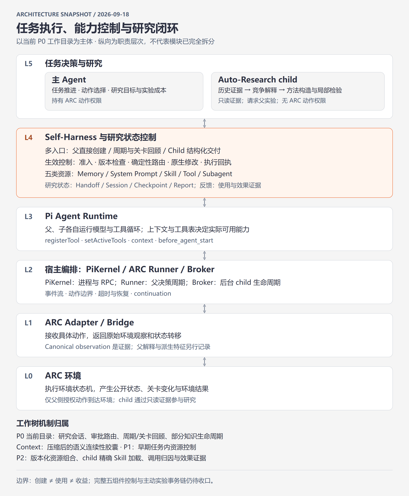

# 当前工程架构与机制：Pi Kernel、主 Agent Self-Harness、Auto-Research

核对日期：2026-09-18。本文记录本次源码检查时的工作目录快照，包含未提交修改，不代表任一 HEAD 单独具有本文全部能力。

本文区分三个层次：代码已经提供的机制、真实运行中观察到的路径，以及尚待实现或验收的设计目标。持久化不等于验证通过，资源暴露不等于实际使用，实际使用也不等于任务收益。

## 1. 纵向架构视图

系统按职责自上而下分为六层。主 Agent 与 Auto-Research 是同一决策层中的两个参与者；Self-Harness 控制与资源管理服务于两者；父、子模型都运行在 Pi Runtime 上。Auto-Research 不是 Pi Runtime 的底层基础设施。



[打开 HTML 架构图](assets/arc-architecture-2026-09-18.html) · [查看高清 PNG](assets/arc-architecture-2026-09-18.png)

图由自包含 HTML 内嵌 SVG 绘制，再经浏览器渲染为 PNG 插入文档；层次自上而下排列，底部标注各工作树的机制归属。

这是职责分层，不声称源码已完全按这些层拆分。尤其 `pi_arc_agi_3_extension.ts` 同时包含环境工具接入、观测投影、动作边界和研究提示。将其进一步拆开仍属于 deferred backlog A。

| 模块 | 当前责任 | 不应混淆的边界 |
|---|---|---|
| PiKernel | 管理 Pi CLI 子进程、RPC、事件、watchdog 和动作边界等待 | 真正的模型循环在 Pi CLI 内，Python wrapper 本身不作游戏推理 |
| 主 Agent | 选择动作、研究目标、证据范围、实验与成本；可直接修改任务内 Harness | 语义决策不必全部集中在父模型，确定性执行交给 runtime |
| Self-Harness | 提供组件操作、上下文投影、路由与效果记录 | Review、finding、报告本身不会自动变成有效能力 |
| Auto-Research | 在独立上下文中研究问题，返回证据、方法和结构化交付 | 不继承完整父 transcript，不直接修改父 Harness，不调用 ARC action |
| Broker | 托管后台 child 计算、保存结果、支持取消与续算 | pending checkpoint 与存活的计算进程不同 |
| Adapter / Bridge | 提供原始环境事实和动作执行 | 不应决定研究内容或把父解释当环境事实 |

## 2. 两条运行回路及其连接

任务回路：

```text
父 Agent 读取当前观察和可用资源
→ 分析 / 调用工具 / 选择研究
→ 一个 ARC action
→ 环境状态转移与 canonical evidence
→ 下一父决策周期
```

研究回路：

```text
父直接提问，或周期/关键节点回顾发现问题
→ 选择历史证据、资源和可达中间目标
→ child 提出竞争解释、构造方法、检验预测
→ 证据足够：提交报告，可附 HarnessDelivery
→ 证据不足：提交实验请求或保存 pending checkpoint
→ 父执行有价值且可承担的实验
→ 新观察用于恢复研究或发起引用旧报告的后续研究
```

二者通过证据引用、研究 session、实验请求与 Harness 资源版本连接。当前 child 可以读取授权原始轨迹，不能仅被理解成“总结父 Agent 文字的助手”。

## 3. 协议字段的直观含义

`HarnessDelivery` 是一份可由代码执行的能力交付单：它写明交付的内容、用途、适用条件、证据、目标版本以及下次如何检查。它与普通研究结论分开；代码路由器根据明确字段选择组件，不重新猜测正文的含义。

| `semantic_kind` | 直观含义 | 示例 | 通常沉淀到哪里 |
|---|---|---|---|
| `fact` | 关于任务或环境的一条认识，可能有适用范围与不确定性 | “在当前关卡，左按钮使环上的值移动一格” | memory |
| `plan` | 当前应该怎样推进的步骤和条件分支 | “先比较两幅图案；若仍不同，找出能改变差异的操作” | memory；需要持续提醒时作为 task prompt 投影 |
| `procedure` | **需要 Agent 判断的可复用做事方法**；告诉 Agent 如何观察、比较、分支和复核 | “对照成功与失败的出口状态，排除位置和动作顺序因素，检验图案一致性” | skill |
| `computation` | **可由工具机械执行的计算或授权操作**；输入输出明确，并有可执行实现 | “输入两张网格，输出不同单元格及其包围框” | tool |
| `role` | 适合交给另一个模型持续承担的职责，包含指令与可用工具 | “独立复核坐标和反例，避免重复父 Agent 的解释” | subagent definition |
| `assessment` | 对某个解释、方法或收益的评价 | “方法在当前两例输出正确，但跨关卡收益未验证” | 研究记录，不直接创建能力 |
| `evidence` | 支撑或反驳结论的材料与记录 | “成功前后两帧及一次失败尝试的精确引用” | 研究记录，不直接创建能力 |

`procedure` 与 `computation` 的分界在于执行方式：前者由模型按方法作判断，后者由已提供的程序或 adapter 实现计算。只有“计算差分”的文字描述而没有可执行定义，不能算已经创建了差分工具。一个 skill 可以指导 Agent 调用 tool；两者分别版本化、分别验证。

其他关键字段：

| 字段或术语 | 直观含义 |
|---|---|
| `basis_refs` | “为什么写下这项能力”：引用实际支撑它的观察、finding 或资源版本 |
| `expected_effect` | “希望它改善什么”：后续需要观察的结果，不是已经发生的收益 |
| `reconsider_when` | “什么时候重新检查”：反例、关卡变化、长期不用等触发条件 |
| `scope` / `exclusions` | 在什么范围适用，哪些场景不能套用 |
| `activation` | 本轮是否把 memory 的任务提示投影给模型的条件 |
| `approval` | Child 对交付内容作出的明确处置；不是独立第三方验证，也不是用户审批 |
| `delivery_hash` | 绑定审批与实际交付正文，防止审批的是 A、应用的是 B |
| `route` / `receipt` | 前者是精确执行计划，后者是该计划某一步实际执行的回执 |
| `CAS` / `target_version` | 修改前检查当前版本，防止旧研究结果覆盖较新的资源 |
| `canonical` | 可回查的原始/正式记录；摘要和 context 投影由它派生 |

## 4. 五类资源的产生、持久化和生效

共同原则：允许父 Agent 直接创建试验性资源，不要求先完成 Auto-Research；引用为空的直接实验不能被标成研究支持。研究路径则要求完整交付、审批与报告。两条路径最终调用相同的 native component handler，但所有生命周期控制尚未完全统一。

| 组件 | 主 Agent 如何沉淀 | Auto-Research 如何沉淀 | 运行目录中的正式记录 | 生效边界 |
|---|---|---|---|---|
| memory | 调用 `task_memory` 保存事实、假设、计划，引用观察或资源依据 | `fact` / `plan` 交付：将研究认识或执行计划路由成 memory | `task-memory.jsonl` | 后续 context 注入索引或正文，全文可按引用读取 |
| system_prompt | 调用 `task_system_prompt` 创建任务内稳定指导片段 | 显式请求 system 通道，并说明 task-wide、稳定、始终可见的契约或不变量证据 | `task-system-prompt.jsonl` | 下一次 `before_agent_start` 组装；不能承诺同一模型请求内撤回 |
| skill | 调用 `task_skill` 保存可复用判断步骤 | `procedure` 交付：把观察、判断、复核流程转成方法说明 | `task-skills.jsonl` 和 `task-harness/skills/<name>/SKILL.md` | 后续 context 暴露索引，Agent 读取正文后可按方法执行 |
| tool | 调用 `task_tool` 提供输入 schema、声明式程序或授权实现 | `computation` 交付：把可机械执行的计算变成真正可调用工具 | `task-tools.jsonl`；调用另记 `task-tool-events.jsonl` | `registerTool` 注册版本化名称，更新后续 provider tool table |
| subagent | 调用 `task_subagent` 定义角色、指令与工具范围 | `role` 交付：保存适合反复委派的独立模型职责 | `task-subagents.jsonl` 和 task-local agent 文件 | 定义可见后，调用 `delegate_task` 才运行 child |

这里的“持久化依据”分两种：内容上的依据是 Agent 给出的证据和理由；代码上的写入条件是 schema、权限、任务范围、版本和路由完整性校验。代码接受写入不等于证明内容正确。

当前 system prompt 的研究路由资格严于普通 memory：要求明确 `explicit_task_contract`（显式任务契约）或 `validated_environment_invariant`（经过验证的环境不变量）及相应证据。这个研究路由条件不能被描述成父直接写入路径已经具有相同的语义证明能力。

所有这些资源默认是 **task/run-local 持久化**。它们能跨当前任务的回合和相关恢复路径保存，不代表已经晋升为跨任务的全局能力库。把 task skill 推广到新任务还需独立的适用范围和迁移验证。

`task_prompt` 是 memory 派生的动态 user/task context，不是第六类持久组件。`task_checkpoint` 保存当前目标、假设、恢复位置和待办操作，属于 runtime 状态，也不是第六类 Harness。

父 Agent 与研究 child 不共享完整上下文。父显式选择 evidence/resource/context refs；child 按授权读取正文。研究产物先存于研究记录，只有通过路由物化后才进入父 Harness。普通临时 `delegate_task(instructions=...)` 不创建持久 subagent definition。

## 5. 资源生命周期与证据生命周期

### 5.1 三种退出动作及中间地带

| 操作或状态 | 含义 | 后续处理 |
|---|---|---|
| unload / unloaded | 暂时移出运行上下文或可用集合，内容未必错误 | 条件合适时可以重新装载 |
| suspend / suspended | 暂停依赖该内容，存在需要复核的问题 | 必须明确重新验证；当前基础控制函数拒绝直接 load |
| retire / retired | 废弃该版本，保留历史审计 | 恢复能力需要新版本 |
| untested | 尚未完成有效检验 | 可作为显式试验性假设使用 |
| supported | 在给定证据和范围内获得支持 | 后续继续监测反例，不代表普遍真理 |
| contested | 存在冲突、反例或未解决分歧 | 缩小适用范围、追加检验；不会仅因该标签自动排除 |
| refuted | 当前论断被证伪 | 知识 eligibility 排除该版本 |

可用性 `availability` 与可信状态 `evidence_status` 分开保存。一个内容可以获得支持但暂时 unloaded；也可以 loaded 且 untested。不能用一次 unload 表示“已证伪”。

内容修改产生新的 `version`；装卸和评估控制使用 `control_revision`。`depends_on_refs` 表示有效性前提，前提失效会使依赖资源需要复查；`supersedes_refs` 明确指出替代关系。`basis_refs` 仅表明来源，不自动等价于有效性依赖。

实现边界：`pi_task_knowledge_lifecycle.ts` 定义双轴状态、控制函数和 eligibility 计算；parent 的统一 `task_harness(action=change)` facade 现在覆盖 memory、skill、system_prompt、tool、subagent 五类写入目标。tool/subagent 的执行与再验证仍受 adapter availability 和后续调用证据约束；facade 回执只证明 mutation，不证明已经使用或产生收益。

### 5.2 从创建到收益的证据阶段

```text
资源创建
→ 后续模型上下文/工具表暴露
→ 读取正文或调用执行
→ 在真实任务中应用
→ 观察语义输出和后续状态
→ 评估方法收益
→ 保留、修订、暂停或退出
```

skill 的读取只能证明指令进入上下文；tool 的 completed 只能证明调用结束；subagent 返回只能证明产生了报告。正向收益需要与后续任务证据关联。记录分布在 `harness-decisions.jsonl`、`harness-observations.jsonl`、组件使用日志和 `effect-assessments.jsonl`。

## 6. 回顾、研究、路由的生命周期

### 6.1 周期回顾与关卡回顾

周期开启时，每 5 个成功 ARC action 构造一次增量窗口，每 20 个动作构造一次整合窗口。只读调用、回顾调用和失败动作不推进这个计数。

```text
窗口就绪 → opportunity → 父提交 review + transition_analysis
→ 保存 review 与 research handoff
→ 父选择 blocking / non_blocking / defer / skip
```

回顾要求说明变化、预测规则、不确定性、下一实验和能力机会，允许明确填写 unknown。已有历史证据可用于比较。候选方法需要说明适用范围、反例、下次使用和验证方法；写下验证计划不代表完成验证。

Review 本身不修改资源。当前实现同时返回 `component_application_plan`，父仍可通过 `task_*` 直接试用候选；周期 handoff 提供继续研究的入口。因此“回顾是研究入口”已经体现，但并没有取消父直接生成试验性能力的路径。

关卡回顾使用完整 outcome window，记录机制、问题、经验和下次尝试，并区分行为归因与 Harness 归因。正向 Harness 归因要求实际应用引用，不能只引用资源创建或 exposure。终态回顾仅允许证据读取与提交回顾。

Handoff 可处于 proposed、active、pending、completed、failed、deferred、skipped 等状态；deferred 可由父重新激活，或按指定的未来动作数条件恢复。控制失败和动作延迟有预算，避免回顾管理循环长期阻断 ARC action。

### 6.2 研究 session 与 child 进程

研究 session 是可恢复的逻辑问题，run 是一次研究执行记录，child process 是实际消耗计算的进程。三者生命周期不能混用。

```text
start → active → completed
             ├→ pending → resume → active
             ├→ failed  → 显式恢复
             └→ cancelled
```

| 模式 | 父的行为 | child 遇到缺证据时 |
|---|---|---|
| blocking | 等待当前计算片段返回 | 可 yield 为 pending，释放父执行路径 |
| non_blocking | Broker 持有后台任务，父继续行动 | 落盘 checkpoint，结束当前计算，session 变 pending |
| pending + next_parent_evidence | 父产生新环境证据 | 父下一 `before_agent_start` 检查 cursor，claim 后后台恢复 |
| pending + manual_resume | 等父明确提供材料或要求恢复 | 不因时间经过自行恢复 |

自动恢复强制 non-blocking；通过证据 cursor 和 session version claim 避免重复消费。没有新证据时不应反复运行同一研究。这里的 cursor 推进是新增证据条件，并不等同于已识别“正好满足实验的关键状态转移”。

Provider 输出 `length` 是计算被截断，不是等待环境证据。实现沿用 native session 继续计算；Auto-Research 还检查连续续算是否推进语义 checkpoint。不能把它与 pending/resume 合并成一种状态。

记录包括 `auto-research-sessions.jsonl`、`auto-research-runs.jsonl`、`auto-research-reports.jsonl`、continuation 日志及 task-context-cache 内的 checkpoint。进程已结束不等于研究 session 已完成。

### 6.3 交付审批与确定性物化

```text
Delivery proposal → pending approval
                  ├→ approved → 完整 structured report → route
                  ├→ rejected → no change
                  └→ deferred → waiting

可执行 route → applying → fulfilled / partial / failed
```

Child approval 决定交付内容；runtime 检查 hash、证据引用、能力支持与版本条件，并调用原生组件接口。父不需要重新把报告自由文本翻译成工具参数。

Blocking 路径在返回前处理 ready route；non-blocking 路径在父控制的 reconciliation 时点处理完成结果。`task_harness(apply_route)` 保留为恢复或幂等重放入口。

每一步成功立即写 receipt。重放跳过已完成步骤；多步骤部分成功时保留已写资源，不作破坏性回滚。已 approve 但未正式 submit report 的内容不被自动当成完成交付。

持久化分别位于 `task-harness-proposals.jsonl`、`auto-research-harness-routes.jsonl`、`auto-research-harness-route-receipts.jsonl`。研究 completed 与 route fulfilled 仍是不同结论。

## 7. 同时检验解释与方法

| 检验对象 | 需要回答的问题 | 面板匹配案例 |
|---|---|---|
| explanation：机制解释 | 什么状态决定成败，预测能否被反例区分？ | “两幅图案匹配后进入出口”与“拿齐钥匙”在何种状态产生不同预测？ |
| method_correctness：方法正确性 | 方法在给定输入上是否产生正确结果？ | 差分方法是否正确找出两幅图案所有不同位置？ |
| method_utility：方法收益 | 正确的方法是否改善当前任务执行？ | 是否减少试探动作，能否迁移到后续关卡？ |

成功事件应触发状态对照：比较失败进入出口、改变特殊格前后、成功进入出口的原始图案，并保留竞争解释。然后构造“比较图案 → 找差异 → 选择改变差异的操作 → 再次验证”的方法。

这套机制提供检验入口、证据读取和方法持久化，但不会自动保证模型提出正确假设。DeepSeek 独立发现面板匹配条件仍需真实模型实验；不能把把规则写入提示后成功当成独立发现。

## 8. 四个工作树的机制分布

以下数量仅计本次检查时的 tracked 修改；不包含新增但未跟踪文件。分支名 P0/P1/P2 不代表线性发布时间。

| 工作树 | 分支与 HEAD | 本次状态 | 主要机制 |
|---|---|---|---|
| `D:/autoresearch_pi_project` | `codex/arc-research-task-bridge-p0` · `457fa1b` | 35 个 tracked 修改 | 当前研究会话、审批路由、五组件、周期/关卡回顾、部分知识生命周期实现 |
| `D:/autoresearch_pi_project_context-optimization` | `codex/context-optimization` · `0f7b3b6` | 14 个 tracked 修改 | 较早研究路由基线，加 continuity capsule 与上下文连续性优化 |
| `D:/autoresearch_pi_project_r8` | `codex/arc-research-task-bridge-p1` · `71f9916` | tracked clean | 早期 memory、guidance、skill、tool-policy、subagent 和效果记录 |
| `D:/autoresearch_pi_project_r9` | `codex/arc-agent-owned-continuation-p2` · `e44d525` | 8 个 tracked 修改 | Agent-owned continuation、资源组合版本化、task tool、child 精确 skill 加载与调用归因 |

| 机制 | 当前 P0 工作目录 | context-optimization | P1 / r8 | P2 / r9 |
|---|---|---|---|---|
| 五类当前命名组件 | 有 | 有较早基线 | guidance/tool-policy 旧模型，无 task_tool 创建模块 | 有 task_tool，仍使用 guidance/tool-policy 模型 |
| 专用 auto_research 与审批/router | 有 | 有较早基线 | 未发现该专用入口与模块 | 未发现该专用入口与模块 |
| durable non-blocking 与新证据自动恢复 | 有 | 有早期 checkpoint/session，未发现该后台模式 | 未发现 | 未发现 |
| 周期 extraction 与关卡 review | 有 | 未发现当前同名机制 | 未发现 | 有 progress candidate，不能等同当前 review |
| availability/evidence 双轴知识模块 | 有，接线仍部分 | 未发现该模块 | 未发现 | 未发现 |
| checkpoint 派生 continuity capsule | 本次未发现该函数 | 有 | 未发现该模块 | 有较早 context pressure/观测压缩机制 |
| child 精确 skill refs 与原生 --skill | 当前采用 task-local context 资源，不能视为已合入 P2 路径 | 同类 context 资源基线 | 早期 delegation | 有，并区分 loader exposure 与读取 |
| 不可变版本文件与精确历史 portfolio | JSONL 版本存在；当前 skill/agent 文件路径与 P2 不同 | 较早路径 | 早期资源形式 | `skills/<name>/vN/SKILL.md`、`agents/<name>/vN.md` |

这些分支有共同历史但存在分叉，不能把文件同名视为机制相同。当前 P0 的 HEAD 也不包含其全部未提交机制。合理的整合候选是以当前控制面为基础评估 context continuity 和 P2 portfolio/归因能力；本文不表示已经合并或逐项兼容。

context-optimization 的 continuity capsule 将 checkpoint 中的目标、假设、排除项、决策理由和 pending operations 投影到压缩后上下文。正式 transcript、checkpoint 和资源 ledger 保持真值源；capsule 是派生视图。child 不因此获得完整父 checkpoint 权限。

## 9. 真实运行证据与验收边界

本次核对的 `runs/arc-lp85-treatment-20260918-114901` 记录展示了：周期 handoff → non-blocking research → child 读取原始 frame 并指出父摘要中的位置错误 → procedure delivery → router → `task_skill` → applied receipt。

落盘资源为 `skill:click-rotation-counter-decode-v1@v1`。它把“区分无效点击、分离计数条与旋转块、从最新原始帧重建预测”的判断步骤保存为 skill，并明确部分目标条件未测试。这证明研究可以纠正父解释并物化方法，尚不证明方法在后续真实动作中的收益。

核查文件：

- `runs/arc-lp85-treatment-20260918-114901/auto-research-sessions.jsonl`
- `runs/arc-lp85-treatment-20260918-114901/auto-research-harness-route-receipts.jsonl`
- `runs/arc-lp85-treatment-20260918-114901/task-skills.jsonl`

依据 AGENTS.md，完整闭环验收必须经过真实 ARC bridge、Pi 父循环、child broker/process、structured report、router、native mutation、动作边界与后续真实父回合。五类组件都要验证语义输出，并覆盖 Auto-Research 与普通 delegate_task 的 provider length continuation。单测、手工 JSONL、离线脚本父模型均不能替代该验收；确定性真实 runner 验收也不能证明真实 provider 行为或游戏质量。

## 10. 尚未收口的机制

1. **统一生效控制仍不完整。** 研究和父直接入口已共享 native mutation，但语义资格、装卸、证据评估和依赖失效在五类组件间尚未完全一致。
2. **主动实验事务链未完整。** 已有结构化 experiment request 和证据 cursor 恢复；尚不能声称每个请求都与父决定、精确动作回执、同 session 恢复完整持久关联。
3. **模块职责仍混合。** ARC extension 同时承担观测投影和 Agent 控制职责，对应 deferred A。
4. **研究条件的比较仍待实验。** 完整/局部轨迹、隐藏父结论、独立复核、反例搜索等视图与目的，需要对照验证，对应 deferred B/C。
5. **压缩后的语义质量不能由 archive 存在证明。** context-optimization 有单独的实现和记录，但当前分支仍需核实合入、启用、hook 顺序及真实模型连续性，对应 deferred D。
6. **持久资源尚不等于跨任务通用能力。** 需要迁移证据、适用范围与后续效果记录，不能仅靠多次回顾或 child 同意提高置信度。

关联待办见 [deferred-research-todos.md](deferred-research-todos.md)。其中历史设计描述可能落后于最新代码，完成情况应以源码与对应运行证据复核。

## 11. 代码与协议导航

- [PiKernel](../src/autoresearch_pi/pi_kernel.py)：Python RPC/process wrapper。
- [ARC runner](../src/autoresearch_pi/arc_agi_3_e2e.py)：父周期、恢复和运行编排。
- [Subagent Broker](../src/autoresearch_pi/subagent_broker.py)：后台 child 进程生命周期。
- [ARC extension](../demo/pi_arc_agi_3_extension.ts)：环境工具接入与动作边界。
- [Self-Harness](../demo/pi_task_local_self_harness.ts)：统一 change facade、review、route apply，以及 memory/skill/system_prompt/tool/subagent 的 native executor 编排。
- [Review](../demo/pi_harness_review.ts)：周期窗口、回顾契约和生命周期投影。
- [知识生命周期](../demo/pi_task_knowledge_lifecycle.ts)：状态、依赖、替换与 eligibility。
- [Tools](../demo/pi_task_local_tools.ts)：可执行任务工具。
- [Subagents / Auto-Research](../demo/pi_task_local_subagents.ts)：委派、会话、恢复和 reconciliation。
- [Child contract runtime](../demo/pi_task_validation_child.ts)：checkpoint 与 structured report。
- [Delivery router](../demo/pi_auto_research_harness_router.ts)：字段驱动的确定性路由。
- [完整协议](auto-research-task-local-self-harness-protocol.md)：详细 schema 和持久化契约。
- [证据驱动设计](plans/2026-09-18-evidence-driven-self-harness-design.md)：目标方案及阶段边界。

本文件是架构快照说明，不自动授权执行 backlog、合并工作树或修改运行机制。
