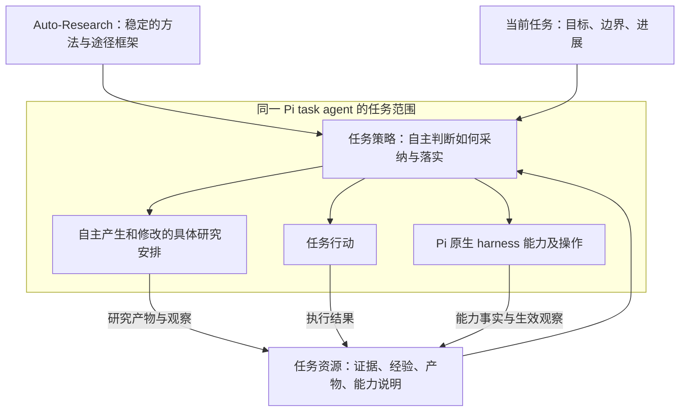
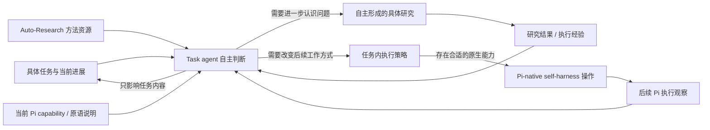
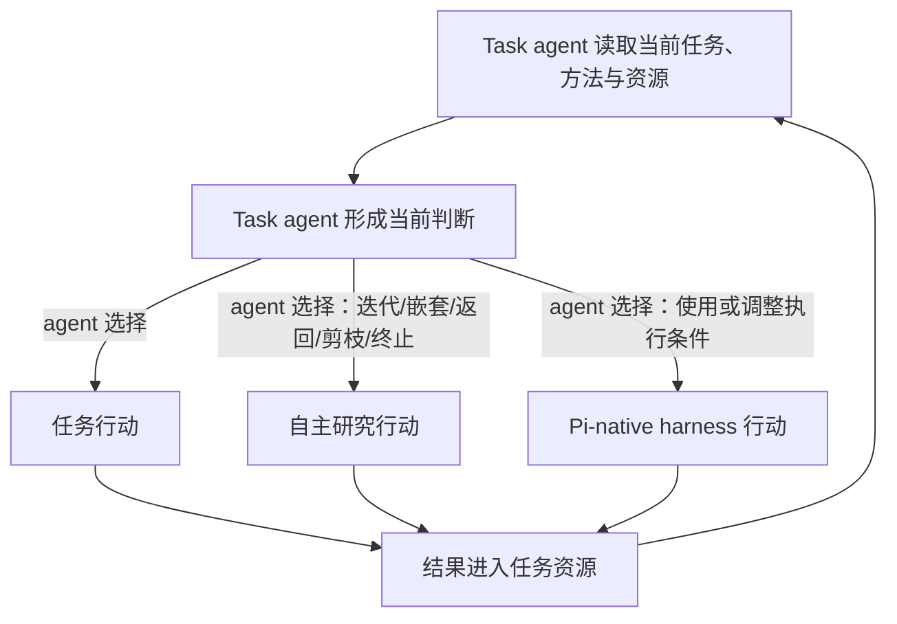

# Auto-Research 与 Pi 原生任务内 Self-Harness 架构设计

- 初始日期：2026-09-06；最近更新：2026-09-07
- 文档标记：`task-local-architecture-v2`，仅用于设计追踪，不是运行时 harness revision。
- 状态：架构基线；已加入最小可运行 demo，待定细节仍不表示生产机制已经实现。
- 前序基线：[harness-boundary-v1](../tracks/2026-09-05-harness-boundary-track-v1.md)。本文延续 Pi-native 和外层精简原则，并明确自主研究、方法稳定、任务策略及任务间隔离。

## 1. 目标与依据

本项目研究一个 task agent 如何在完成单个具体任务的过程中，自主设计研究、利用探索经验，并调整自身的 harness。Auto-Research 提供通用研究方法和途径框架；实际 agent loop、工具执行与运行时策略由 Pi 原生机制承载。

顶层架构设计的是“如何让 agent 自主设计研究”的条件，不预先生成具体研究流程。是否开展研究，如何划分阶段，是否迭代、嵌套、回访、替换方案或结束，由 task agent 根据任务和执行情况决定。

一次具体研究可以仅澄清中间问题，也可以与最终交付目标没有直接对应关系。研究与 harness 的联系，由 task agent 根据当前任务建立，不要求每次研究产生 harness 变更。

本文依据截至 2026-09-06 的对话共识，以及仓库内的设计笔记、track 和交接文档。原先指定的 `/mnt/data/pi_kernel_minimal_mutation_design_constitution.md` 与 `/mnt/data/handoff.md` 在当前 Windows 可见环境中未找到；实际读取的是仓库根目录的 `handoff.md`。本文不替代或声称已经核对原始宪法全文。若原文后续可用，应继续以用户指定的原始宪法约束本项目设计。

## 2. 已确认的架构约束

1. **Pi 是唯一 agent runtime。** 具体能力优先采用 Pi 官方 extension、tools、hooks、session 等公开机制。
2. **外层保持精简。** `PiKernel` 负责进程、RPC、session 命令和事件传输；Python task-facing client 提交任务并接收结果，不重建 agent loop。
3. **Auto-Research 方法保持稳定。** Task agent 不修改通用方法说明。执行、研究和策略调整产生的后果，只更新当前任务可引用的资源。
4. **研究结构由 agent 自主设计。** 不引入固定研究阶段、必经步骤、递归触发器、自动回访规则或统一终止流程。
5. **Harness 原语是逻辑能力单位。** 原语用于独立指认、理解和表达可调整模块，不要求与一个 Pi tool 一一对应，也不构成新的执行协议。
6. **变更保持原语粒度。** Task agent 可使用、更新或从 0 到 1 实现某个原语；其意图、变化和观察应能在具体原语或资源上表达，不采用无界的整体 harness 改写。
7. **演进仅发生在单任务内部。** 同一任务可跨阶段、多轮交互、嵌套研究及中断后继续；不同独立任务从相同初始基线开始，不继承其他任务的经验、策略、记忆或 harness 修改。
8. **尊重真实生效边界。** 官方机制不支持的操作或所需生效方式，明确记录“不支持”；尚未核实的能力记录“待核实”，不能据此宣称支持。
9. **不增加第二层 harness 控制面。** 不引入统一 `switch_harness` / `mutate_runtime`、Kernel 原语注册表、策略到 Pi 命令的通用编译器或私有 RPC。
10. **不以外围机制伪造 Pi-native 能力。** 不使用 supervisor、file watcher、monkey patch，也不恢复 `HarnessState`、`modify_harness`、整体 revision、AST validation、candidate、rollback 等旧控制机制。

## 3. 任务、研究与执行边界

| 概念 | 本文含义 |
|---|---|
| 独立任务 | 用户发起的一个独立目标及其边界，是状态积累与隔离的基本范围 |
| 任务内阶段 | Agent 针对任务自行形成的工作划分；可以修改，也可以不划分 |
| 具体研究 | Agent 针对某个问题自主设计的探索安排，可以只服务一个中间依赖 |
| 迭代 | 针对仍在处理的问题，根据新信息继续或修正安排 |
| 嵌套研究 | 为澄清当前工作的依赖而进入另一项研究，并按需要返回上层 |
| Pi session / prompt / 模型与工具步骤 | 实际运行边界，不能与上述研究关系直接等同 |

嵌套研究在逻辑上属于同一独立任务。它不自动获得独立的文件、上下文或 extension 状态。一次 Pi 执行可能包含多个研究步骤，同一研究也可能跨多次交互继续。

同一任务中断后继续，应能够保留其工作状态；具体恢复方式必须依赖实际支持的 Pi 机制。这里表达的是设计需求，不声称仓库已有可靠恢复能力。

## 4. 逻辑架构

下图表达信息依赖和职责关系，不规定运行顺序，也不要求每次经过所有节点。

图中的模块首先是逻辑职责。推荐由同一个运行在 Pi 内的 task agent 承担研究设计和策略判断，不要求增设 Meta agent、独立策略服务或外层调度进程。

### 4.1 Auto-Research：稳定的方法资源

Auto-Research 提供研究方法、途径框架、推理启发和可参考的例子，例如如何认识不确定性、寻找有区分力的证据、理解依赖及权衡探索成本。

它不保存当前任务的完整研究方案，不绑定具体 harness 实现，不替 agent 决定下一步操作。方法中的参考问题不应被转换成每轮必填表单。

通用方法允许 agent 在设计时考虑当前可用、可调整的资源。具体能力和 task-specific 信息由任务环境提供，不回写进通用方法。方法载体可优先考虑 Pi 已支持的 skill 或文档加载方式，具体包装形式仍待确认。

### 4.2 任务资源：可供当前任务使用的信息与能力

任务资源涵盖当前任务事实、研究产物、执行观察、经验、未解决问题，以及实际可用 harness 能力的说明或引用。

这里的“资源”是可被 agent 读取和利用的内容，不表示要实现一个新的 Resource API、统一数据库或资源状态镜像。优先引用已有任务文档、产物、工具结果和原生状态入口。

通用能力说明与当前运行事实需要区分：说明可以解释用途和限制，当前是否可用、何时生效、是否被执行观察到，则需要运行依据。说明文档不能取代真实状态。

经验保持证据和适用条件的身份。一次局部有效的做法不能自动变成 Auto-Research 的通用规则。任务归档也不能作为其他独立任务的初始资源被加载或检索。

### 4.3 任务策略：研究资源与具体执行之间的连接

任务策略是新增的核心逻辑职责：task agent 结合任务目标、资源和实际能力，判断哪些方法或发现值得采纳，以及如何落实到后续工作。

它可能形成任务行动、研究安排或执行方式的调整。只有部分执行方式调整需要修改 harness。任务策略不把每个研究问题绑定到一个原语，也不把所有执行困难归因为 harness 问题。

单任务长程执行应能保留已经采纳的策略，供后续阶段和嵌套研究引用、修订或弃用。推荐先采用 agent 自主管理的普通工作文档：按需要保留当前意图、相关依据和适用范围，格式与更新时机由 agent 决定。

这份工作产物不被 Kernel 解析成执行流程，也不构成另一套可执行策略语言。它表达 agent 当前采纳的安排，不是不可更改的指令清单。

### 4.4 Task agent runtime：Pi 原生执行

真正进行推理、设计研究、调用工具与调整策略的是运行在 Pi 内的 agent。研究与策略材料作为它可访问的上下文和资源使用。

仓库中的 Python `PiTaskAgent` 是 task-facing client，并不是第二个负责推理和工具 continuation 的 agent。新增逻辑职责不应成为向该 Python 类添加研究循环或工具执行循环的理由。

### 4.5 Self-harness：Pi 原生能力的任务内调整

具体原语通过 Pi 原生 extension、tools、hooks 及公开 session 能力实现。一个逻辑原语可能由多个原生机制共同承载，其状态由具体实现维护。

原语说明帮助 agent 理解可调整条件、操作入口、影响范围和实际生效位置。Agent 据此直接使用当前 Pi 环境提供的入口，不经过通用“原语命令到 Pi 命令”的适配器。

实现新原语、让 Pi 加载该实现、实际执行它，是不同的事实。写入源码不等于当前 session 已获得新能力，更不等于当前生成过程能立即使用它。无法通过官方机制在所需边界生效时，应如实记录限制。

### 4.6 PiKernel 与外层 client

外层仅承载启动、连接和观察执行的必要工作：提交任务、发送官方 RPC、管理相关进程与会话连接、接收 response 和事件。

任务本地路径、基线配置等可以通过既有启动入口传入；不为此增加 harness 状态机、研究调度器或隐式进化机制。`steer` / `follow_up` 保持原生消息控制语义，不被描述为任意 harness 热替换能力。

### 4.7 Meta-harness runtime 的层级定位

这些层表达抽象和控制责任。它们不要求一层对应一个进程、类或 API；当前推荐由同一个 Pi task agent 承担 L3 与 L2 的判断。

| 层 | 定位 | 输入 | 产出 | 是否拥有执行控制 |
|---|---|---|---|---|
| L5 用户任务约束 | 给出最终目标、范围、验收条件与授权资源 | 用户输入、外部条件 | 任务边界 | 用户拥有最终控制 |
| L4 Auto-Research 逻辑架构 | 提供 agent 自主设计研究所需的方法、关系和问题意识 | 稳定方法资源 | 可供 agent 采用的研究途径 | 否，不调度步骤 |
| L3 任务策略与自主研究设计 | 把任务、研究结果和能力事实解释为当前任务的下一项选择 | L5、L4、任务资源 | 研究安排、任务行动或执行策略 | 是，由 task agent 判断 |
| L2 Self-harness 自进化 | 把已采纳的执行策略落实为任务内某个原语的使用、更新或实现 | Agent 的具体意图、Pi 能力 | 任务内执行条件变化及观察 | Agent 发起，具体原生能力执行 |
| L1 Pi 原生 harness/runtime | 承载 agent loop、tools、hooks、skills、context、session 与 extension 状态 | Prompt、原生操作、资源 | 模型/工具结果、原生事件和实际状态 | Pi runtime 执行 |
| L0 PiKernel / task-facing client | 启动、连接、提交和转发官方 RPC/event | 调用方请求、Pi events | 传输结果 | 只控制连接，不控制研究或 harness 语义 |

任务资源构成贯穿 L4 到 L1 的数据平面：L4 可被当作稳定的方法资源；L3 读取当前任务资源并写入新的研究结果和策略；L2 写入原语变化及其观察；L1 提供实际工具结果和事件。资源平面不获得独立的调度权。

从上往下看，是从任务含义到实际执行的逐步落实；从下往上看，是执行事实返回任务判断的反馈。Self-harness 位于 task agent 处理过程内部，是具体执行条件的自进化层；Auto-Research 位于其上方，只提供 agent 设计研究的逻辑架构。

## 5. Auto-Research 如何与 self-harness 联系

Auto-Research 和 self-harness 之间不建立直接调用关系。二者通过 task agent 和任务资源自然结合：Auto-Research 让 agent 能够探索与认识问题；self-harness 让 agent 能够改变当前任务的执行条件。是否把一个研究结果转化为 harness 变化，由 task agent 根据最终任务判断。

### 5.1 逻辑关系

图中的连线是可能发生的信息关系，不是固定顺序。Task agent 可以直接行动，可以研究后保持 harness 不变，也可以根据已有任务资源直接调整某项执行条件。Auto-Research 不调用 self-harness，研究结果也不自动生成 mutation。

### 5.2 自然连接点：任务内执行策略

研究结果首先是一项任务资源。Task agent 将它放回当前任务，判断它影响的是任务内容、研究安排还是重复出现的执行方式。只有最后一种判断可能进入 self-harness。

执行策略应表达 agent 想在当前任务后续执行中稳定改变的行为及其依据。例如：“后续复用这组证据时保留来源和观察日期。”它比“改进 memory”更接近任务，也比一个工具调用更能说明为什么需要变化。

任务内执行策略不是新的可执行 DSL。它可以只是 agent 工作记录中的一句说明。Agent 再根据当前 Pi 能力决定：直接采用一次性操作、使用已有原语、更新原语状态，或在任务范围内实现一个新原语。如果官方能力无法在所需边界生效，就保留策略需求并记录“不支持”。

### 5.3 原语在连接中的角色

逻辑原语提供三种语义：可独立指认的执行条件、可理解的影响范围、可观察的生效位置。它使 task agent 能把“改变工作方式”的意图落到一个具体部件，而不需要一套统一 harness API。

一个原语可由 Pi 原生 tool、hook、skill/context 或 session 状态的组合承载。原语说明可以依附现有工具描述和相邻文档；当前可用性和实际状态仍由 Pi 运行事实决定。Task agent 使用实际 Pi 入口，不先调用一个抽象的 `primitive.mutate()` 再由 Kernel 翻译。

### 5.4 三种分离的 handoff

为了让长程任务中的反馈可被后续设计使用，需要区分三类信息。它们可以写在普通任务文档中，不要求建立三套服务或固定 JSON schema。

| Handoff | 最小语义 | 接收者如何使用 |
|---|---|---|
| Research handoff | 子问题、所得结果、证据来源、剩余不确定性、与上层问题的关系 | 上层 task agent 重新判断后续工作 |
| Task-strategy handoff | 当前采纳的任务行动或执行方式、依据、适用范围 | 同一任务的后续阶段引用、修订或弃用 |
| Self-harness handoff | 原语、变化意图、Pi 原生实现、作用域、实际 before/after/observation、限制 | 后续执行理解当前能力事实，并供检查变化来源 |

Research handoff 不要求父研究采用其建议；self-harness handoff 不宣称变化有效；task-strategy handoff 不进入其他独立任务。Auto-Research 的通用方法在三类 handoff 中都保持不变。

### 5.5 归因与观察边界

Harness 变化后要分别回答：Pi 是否接受了操作、相关状态是否改变、后续 Pi execution 是否看到了新条件，以及当前任务表现是否可能受益。

`before → mutate → after` 中的 `after` 应来自之后的 Pi 执行观察；仅有 mutation handler 返回成功或 agent 自述不够。即使后续执行已经看到变化，也只能支持“生效”，不能单独支持“任务改善由此导致”。多次研究可能共同支持一次调整，一次研究也可能只修正任务内容。

本设计只要求事实保持可区分，不增加候选、打分、validation 或 rollback 系统。

## 6. 自主迭代、嵌套与资源反馈

迭代、嵌套、返回、终止和剪枝是 task agent 可以表达的研究关系，不是 Auto-Research runtime 的状态机命令。Auto-Research 提供理解这些选择的方法，task agent 根据当前研究结果和任务价值自主决定是否采用。

### 6.1 决策所有权

| 选择 | 含义 | 决策者 | 结果如何进入任务 |
|---|---|---|---|
| 直接继续任务 | 当前信息足够，不展开研究 | Task agent | 产生普通任务结果 |
| 迭代 | 保持当前问题，改变询问、证据或执行条件后继续认识 | Task agent | 新结果更新当前研究资源 |
| 嵌套 | 当前工作依赖一个可独立澄清的子问题 | Task agent | 创建逻辑子研究关系 |
| 返回 | 子研究把结果和不确定性交给上层 | Task agent | 形成 research handoff，上层重新判断 |
| 剪枝 | 已考虑或已展开的方向对当前任务不再值得投入 | Task agent | 保留剪枝依据，停止投入该方向 |
| 终止研究 | 当前研究不再值得继续或已经足够 | Task agent | 返回上层或结束根研究 |
| 终止任务 | Agent 判断用户任务已完成、受限或需要用户输入 | Task agent，服从用户约束 | 形成最终交付或明确阻塞 |
| 调整 harness | 后续工作方式需要稳定改变，且有合适能力 | Task agent | 使用 Pi 原生入口并产生变化观察 |

架构不规定“冲突必须迭代”“未知必须嵌套”“预算低于阈值必须剪枝”等规则。Agent 可以借助 Auto-Research 方法评估信息价值、依赖、证据充分性和探索成本，但具体判断随任务产生。

### 6.2 动态研究结构

Task agent 可以按需维护一份轻量的研究视图，表达当前问题、父子依赖和返回关系。它可以是普通工作笔记，不需要中央 node registry，也不必始终构成严格树：一个发现可能被多个后续判断引用。

嵌套表达的是认识上的依赖，不等于创建新 agent、Pi session 或进程。研究节点结束也不意味着 runtime 状态恢复。若同一 Pi session 中的原语变化具有 session 或 extension-process 作用域，它可能继续影响父级及兄弟分支；task agent 必须根据真实能力说明理解这一事实。

研究深度、局部迭代数和 task turn 数彼此独立。一次 task turn 可以推进多个逻辑研究关系；一个研究迭代也可以跨多个 Pi prompt 或模型/工具步骤。实现和分析中应保留这些层级，避免用单一 `turn` 字段混称。

### 6.3 控制流

这个反馈图只说明 agent 可以重新判断，不要求每个结果都启动下一轮，也不在外层写一个 `while research` 控制器。实际 continuation 由 Pi agent loop 和用户允许的交互承载。

### 6.4 数据流与资源反馈

| 数据类别 | 来源 | 任务内去向 | 可否进入下一独立任务 |
|---|---|---|---|
| 通用 Auto-Research 方法 | 共同基线 | Task agent 的研究设计上下文 | 以同一只读基线重新提供 |
| 具体研究结果 | 当前研究 | 父级研究、任务策略、任务产物 | 否 |
| 研究关系与剪枝依据 | Task agent | 当前任务工作记录和 handoff | 否 |
| 执行结果与产物 | Pi tools / 外部环境 | 任务资源及验收判断 | 否，除非用户作为新输入重新提供 |
| Capability 说明 | Pi extension/tool/相邻文档 | Agent 判断可用执行条件 | 下一任务重新从基线发现 |
| 原语状态与变化观察 | Pi runtime | 当前任务策略与 self-harness handoff | 否 |

资源反馈是事实更新，不是对 agent 下一步的强制指令。“同步给 Auto-Research”指以后使用 Auto-Research 方法进行判断时，task agent 能访问这些当前任务事实；不存在一个 Auto-Research 服务接收事件后自动编排流程。

### 6.5 Handoff 的返回语义

子研究返回时至少需要让上层理解：它回答了什么、依据在哪里、哪些问题仍开放、结果适用于什么条件。是否继续、回访、剪枝其他分支、改变任务内容或调整 harness，全部由上层 task agent 重新判断。

Self-harness 变化应独立交接，因为它可能越过逻辑研究节点的边界影响后续 Pi 执行。相关 handoff 记录实际作用域和观察结果；它不与 research handoff 合并成一个笼统“研究完成”状态。

### 6.6 失败、受限与终止

研究没有得到结论也可以正常返回：handoff 保存当前证据、无法确定的原因和对上层判断的影响。某项 Pi 能力缺失时，task agent 可以选择其他任务手段或结束相关探索；架构只要求把能力记录为“不支持”。

剪枝和终止都应保留当时依据，使同一任务后续在条件改变时能够重新评估。它们不是永久删除资源，也不触发自动 rollback。时间、调用量和用户授权资源继续作为约束被 task agent 考虑。

## 7. 单任务演进与独立任务同基线

### 7.1 基线与任务状态

| 内容 | 同一任务内 | 不同独立任务之间 |
|---|---|---|
| Auto-Research 通用方法 | 稳定、只读 | 相同初始内容 |
| 初始 harness 能力与默认配置 | 在初始基线上进行任务本地调整 | 每次从同一基线开始 |
| 用户任务输入 | 按任务授权使用 | 各自输入可以不同 |
| 研究安排与任务策略 | 保留、引用、修订、弃用 | 不继承 |
| 任务记忆、经验、产物 | 服务本任务及其嵌套研究 | 不加载、不自动检索或晋升为共享资源 |
| Harness 的任务内状态与实现变化 | 按真实作用域使用和继续调整 | 不影响下一任务的初始状态 |
| 任务归档与未来 trace | 可供本任务继续或外部检查 | 不进入其他任务的 agent 可用资源 |

相同初始状态指相同方法、初始能力、配置和初始记忆基线。它不要求不同任务输入相同，也不承诺模型随机性或所有外部系统状态相同。

### 7.2 推荐的最薄隔离方式

共同方法与初始 harness 作为固定基线使用。Task agent 产生的研究记录、策略、可变资源和扩展实现修改留在当前任务的资源范围内。需要编辑原有实现时，使用任务本地副本，不改变供其他任务初始化的共享来源。

独立新任务获得新的 Pi 会话及任务资源范围，并重新使用同一初始配置。原生机制允许的会话保存与恢复用于继续同一任务，不能用于把已演进的会话作为下一独立任务的起点。

推荐每个独立任务从共同配置启动独立的 Pi 实例，同时使用任务本地资源，避免 extension 闭包状态和进程内缓存跨任务延续。这属于任务启动方式，不要求在同一任务的研究迭代或 harness 调整时重启 Pi。若考虑复用进程，必须先确认官方机制能够重新初始化相关状态，不能假定创建新 session 就会清空所有扩展状态。

新建 session 或更换 `cwd` 本身不足以证明任务隔离。实现时必须确认资源发现、默认加载、文件访问范围、配置、历史和检索入口不会把其他任务状态带入。当前目录不构成权限沙箱；如果工具仍可访问旧归档或共享可变状态，就不能宣称已经达到该隔离要求。

工具对外部系统的修改也不会因会话结束而自动消失。需要相同外部初始条件时，应使用任务独立输入或受支持的隔离环境；无法提供时，明确列出限制。

这些是隔离要求，具体 Pi 启动选项、目录和权限方式需要在当前安装版本上核实。本设计不以新增 supervisor、跨任务 rollback 或共享进化存储来实现隔离。

## 8. 工作记录、任务记忆与 harness trace

任务策略和研究工作记录属于当前任务的工作产物。任务记忆可以引用证据和相关资源变化，使 agent 能够继续工作；不要求将全部事件复制成一套新日志。

未来的独立 harness change trace 仍保持与任务记忆不同的职责：按原语或资源记录变化、作用域和相关观察，不能退化为“整个 harness 的版本号”。它仅服务当前任务及外部检查，不参与跨任务经验继承。

独立 trace 的 schema、持久化、查询接口和实现继续暂缓。任务侧暂时保留变化说明或原生结果引用，不表示已实现该 trace 模块。

## 9. 关键决策与取舍

| 决策 | 背景与理由 | 代价或限制 |
|---|---|---|
| 顶层提供方法、资源与执行能力，研究结构由 agent 自主形成 | 多样任务无法预先确定统一研究流程 | 不能通过检查固定步骤是否完成来判断自主设计是否有效 |
| 增加“任务策略”逻辑职责 | 明确研究所得如何影响任务行动或执行方式，避免强行绑定研究与原语 | 策略与结果仍需具体任务判断，不能自动把修改认定为优化 |
| 长程任务保留可修订的工作产物 | 支持阶段推进、嵌套返回和继续同一任务 | Agent 需按需要维护，过多记录或过时记录都可能干扰执行 |
| 原语只作能力表达，具体操作直达 Pi 原生入口 | 保持唯一 runtime 和实际状态来源 | 异质能力没有统一调用形态，生效边界需逐项确认 |
| 执行后果只更新任务资源，方法保持稳定 | 保持通用方法与具体经验的隔离 | 经验不会自动改进通用方法或后续独立任务 |
| 独立任务同基线、任务内持续演进 | 明确研究范围并避免任务间状态污染 | 必须核实文件、配置、历史和外部资源隔离，单独新建会话不够 |

曾考虑仅依赖会话上下文承载研究安排：它最轻，但难以保证长程工作中的依据和未完成依赖持续可用，因此推荐由 agent 按需维护显式工作产物。若后续发现资源事实可见性不足，可以在实际缺口处使用少量 Pi 原生扩展辅助；不预先实现统一 capability 注册表或报告协议。

## 10. 与当前仓库实现的关系

以下是源码层面的现状说明，不是本轮新的运行验证结论。

| 文件或概念 | 当前情况 |
|---|---|
| `src/autoresearch_pi/pi_kernel.py` | 已有进程和 JSONL RPC 桥接代码，含 prompt、steer、follow_up 及事件收集相关方法 |
| `src/autoresearch_pi/task_agent.py` | 已有提交 prompt、读取结果的薄 Python client；没有实现本文的任务策略或资源持续管理 |
| `tests/pi_native_smoke_extension.ts` | 已有工具与上下文 hook 的示例源码；其存在不等于真实执行或动态效果已获验证 |
| `src/autoresearch_pi/meta_harness_demo.py` | 确定性的架构 demo，生成文档、handoff、决策 trace 与层级分析；它不是生产研究控制器 |
| `demo/pi_native_harness_extension.ts` | 使用 Pi 官方 tool、hook 和 command 的测试扩展；command 仅用于无模型集成驱动 |
| 方法资源、任务策略、任务资源组织 | 本文明确逻辑职责；demo 给出一种可检查样例，生产载体与实时模型连接尚未完整实现 |
| 独立任务同基线、任务内恢复、原语级变化反馈 | 架构要求，尚不能据现有薄桥接代码宣称已经满足 |

### 10.1 最小独立 demo

仓库提供 `meta-harness-demo`。它使用确定性的 task-agent 决策 fixture 展示根研究迭代、嵌套子研究、返回、剪枝、原语调整和终止；runner 仅执行并记录这些决定，因此该 fixture 用于复现架构关系，不作为实时模型自主性的证据。

Self-harness 部分实际启动本机 Pi RPC，并加载 `demo/pi_native_harness_extension.ts`。扩展使用官方 `pi.registerTool()` 注册 `set_evidence_policy`，用 `before_agent_start` 将当前策略提供给后续 agent start。模型无关的测试命令在同一扩展实例中驱动 `summary_only → source_and_date → observed source_and_date`，从而在没有远程模型的情况下验证原生 extension 状态路径。

随后 demo 生成有效 DOCX，写入 Auto-Research handoff、self-harness handoff、task-agent 决策数据和轮次层级分析。运行方式、文件清单与能力边界见 [demo README](../../demo/README.md)。

本地 OfficeBench-style 检查只验证该 DOCX 合同，不等同于外部完整 OfficeBench evaluator。Pi 命令的后续观察证明扩展状态在同一 Pi 进程中可见，但不证明实时模型自主选择了该工具，也不证明任务质量提升由该变化造成。

真实模型自主决策、`before_agent_start` 对后续模型输入的实际影响、独立任务隔离和完整 OfficeBench evaluator 仍需后续验证。

`harness-boundary-v1` 保留为历史设计基线。旧笔记中的“Auto-Research 读取资源”和“每个 Auto-Research turn 结束同步”应按本文解释为任务资源可见性与更新需求，而不是独立 Meta 服务或固定同步协议。此前提出的统一 `CapabilityDescriptor`、`describe_harness` 和固定 turn report 均不是已确定的必建模块。

## 11. 仍需对齐的具体设计

1. 原语的独立边界、命名和粒度。讨论具体接口前必须重新提醒并对齐；`memory.read` / `memory.write` 等例子尚未定案。
2. 通用方法的实际包装形式，以及能力说明如何利用 Pi 已有的资源加载和工具描述机制。
3. 任务策略与研究工作产物的最小组织方式，以及保留哪些依据才能支持长程继续，同时避免变成固定表单。
4. 当前安装 Pi 版本中可用的能力、真实生效位置与恢复方式。不把一次模型步骤、prompt、session 和研究迭代混称为 `next_turn`。
5. 任务本地资源、可编辑 extension 实现、历史及配置的实际隔离方式；特别是全局发现和检索入口是否可能泄漏其他任务状态。
6. 同一任务中多个逻辑研究分支使用共享能力时，如何理解作用域和让相关变化被后续执行知晓。
7. 独立 harness trace 的最小需要，待后续单独设计，当前不实现。

跨任务经验继承、修改通用 Auto-Research 方法、固定研究流程及第二层 harness 协议，均不属于待补齐的功能。

## 12. 后续如何判断设计是否有效

后续可以用不同性质的任务检查以下能力；这些是对架构的观察点，不是为 agent 规定的研究步骤，也不是新增 runtime validation 框架：

- 简单任务允许直接执行；复杂任务可以自主形成不同的研究安排，而非始终套用相同阶段。
- 一项研究可以不修改 harness；需要调整时，能够追溯到具体任务条件、相关依据和原语级变化。
- 长程任务能够继续先前工作、处理嵌套研究的返回，并根据新信息修订策略。
- 实际 Pi 操作后的生效观察与 agent 自述相区分，不把命令接受当作后续执行已使用变化。
- 先在一个任务中产生策略、资源和 harness 变化，再启动另一个任务时，其初始资源和配置仍与共同基线一致，且没有加载或检索到前一任务的状态。
- 整条核心执行路径仍使用 Pi 原生 agent loop 和公开接口，外层没有承担研究编排或 harness 运行控制。

## 13. 相关文件

- [前序 harness 设计笔记](../harness-primitive-design-notes.md)
- [harness-boundary-v1 历史标记](../tracks/2026-09-05-harness-boundary-track-v1.md)
- [仓库 handoff](../../handoff.md)
- [PiKernel](../../src/autoresearch_pi/pi_kernel.py)
- [Python task-facing client](../../src/autoresearch_pi/task_agent.py)
- [Pi 扩展示例](../../tests/pi_native_smoke_extension.ts)
- [最小 meta-harness demo](../../demo/README.md)

本文为架构文档。本次落盘不代表完成 runtime 实现、任务隔离或真实模型验证。
