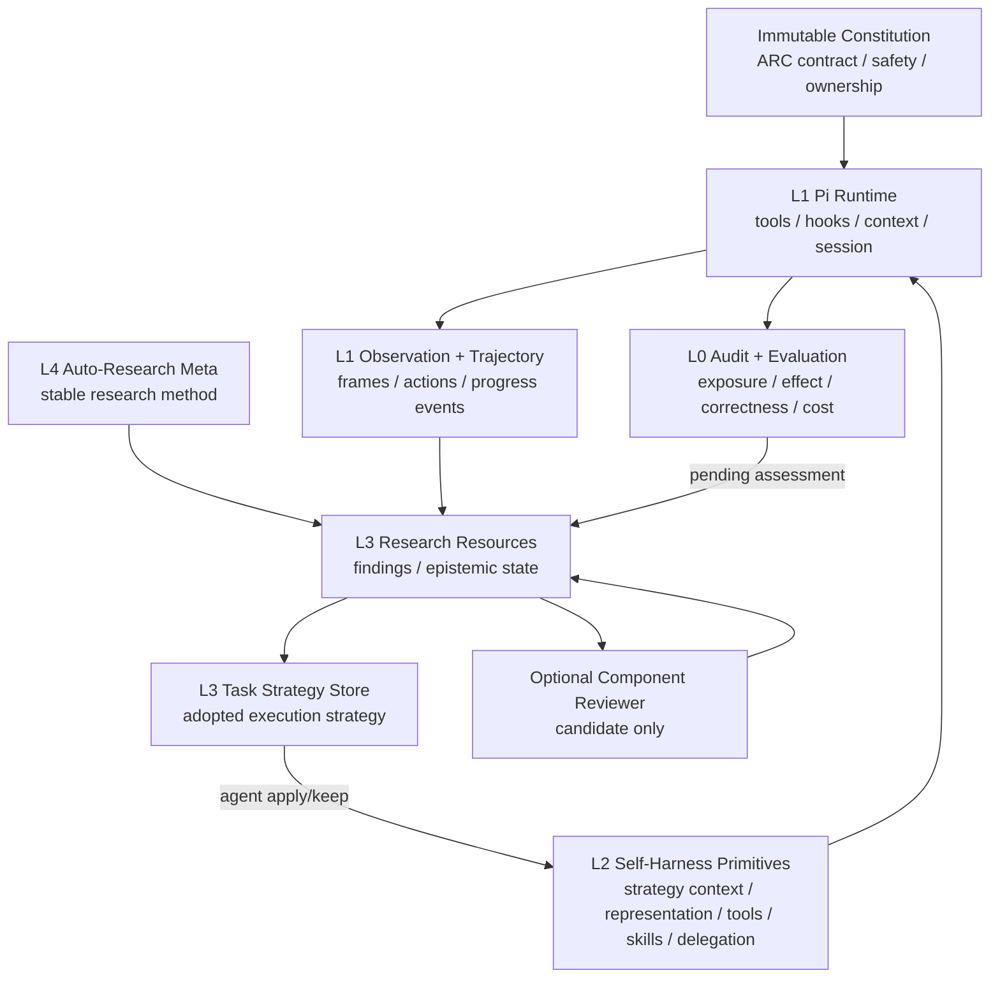

# Continual Harness 机制背景与 Auto-Research Meta + Self-Harness 吸纳建议

- 日期：2026-09-11
- 状态：Proposed architecture review；本文不表示相关运行时能力已经实现或验证
- 适用范围：当前 `autoresearch_pi_project` 的 task-local Auto-Research Meta、Pi-native Self-Harness 与 ARC-AGI-3 实验
- 外部参考：
  - [Continual Harness 论文](https://arxiv.org/abs/2605.09998)
  - [Continual Harness ARC-AGI-3 实现](https://github.com/feng-rrRay/Continual-Harness-ARC-AGI-3)
  - [ARC base orchestrator policy](https://github.com/feng-rrRay/Continual-Harness-ARC-AGI-3/blob/main/agents/templates/continual_harness/prompts/base_orchestrator_policy.md)
  - [ARC ContinualHarness agent](https://github.com/feng-rrRay/Continual-Harness-ARC-AGI-3/blob/main/agents/templates/continual_harness_agent.py)
  - [HarnessEvolver](https://github.com/feng-rrRay/Continual-Harness-ARC-AGI-3/blob/main/agents/templates/continual_harness/harness_evolver.py)
- 当前项目依据：
  - [Auto-Research 与 Pi 原生任务内 Self-Harness](2026-09-06-autoresearch-pi-task-local-architecture.md)
  - [Auto-Research / Pi self-harness 优化记录](../tracks/2026-09-07-autoresearch-self-harness-optimization.md)
  - [Harness primitive design notes](../harness-primitive-design-notes.md)

## 1. 结论

Continual Harness 最值得吸收的不是单一 `evolve_harness` 控制器，而是以下能力：

1. 固定 constitution、可变策略与每轮 observation 的三层 prompt 分离；
2. 面向模型的、有界且可追溯的 trajectory review；
3. 可修订的认知状态，包括假设、确认、反证和适用范围；
4. level-up、game-over、no-progress 等具有任务含义的进度事件；
5. component-scoped reviewer、受限 subagent 与 executable skill 的明确边界；
6. 对每次演化输入、输出、应用结果、token 和成本的分 scope 审计。

这些能力必须拆分吸收到现有 L4–L0 模块，不能整体并入 Self-Harness：

```text
Continual Harness 的长期在线适应能力
                 +
当前 observation → finding → apply/keep → Pi exposure
     → bounded effect → independent validation → absorption
                 -
外层自动研究、四组件联合重写、跨任务默认继承、无后验验证的直接应用
```

核心决策保持不变：Pi 是唯一 agent runtime；task agent 拥有研究和变更决策；Auto-Research Meta 不调度步骤；Self-Harness 只负责落实 agent 已经采纳的、原语级执行条件变化。

## 2. Continual Harness 的机制背景

### 2.1 研究目标

Continual Harness 面向长程、部分可观察、需要持续交互的任务。论文将 harness 表达为四类可在线调整的状态：

- prompt `p`；
- subagents `G`；
- skills `K`；
- memory `M`。

Agent 从最小环境接口开始，在同一次不重置的 episode 中交替执行任务和调整上述 harness 状态。Refiner 可以读取历史 trajectory，并将运行中的失败、成功模式和新发现转化为 prompt、memory、skill 或 subagent 的 CRUD 更新。

这是一种 test-time online adaptation：不是只在运行结束后离线优化下一次配置，也不是通过重启 episode 比较候选 prompt。

### 2.2 ARC-AGI-3 实现中的主循环

ARC 实现为每个 game 创建独立 agent 和日志目录。`ContinualHarness` 自己驱动游戏主循环：

1. `NOT_PLAYED` 时自动 RESET；
2. `GAME_OVER` 时先运行一次 evolution，再 RESET；
3. 每个 outer iteration 进行一次 orchestrator 决策；
4. orchestrator 可以调用 memory、skill、subagent 等分析工具，也可以提交一组 game actions；
5. level-up 后立即 evolution；
6. 长时间没有 score/level progress 时触发 stagnation evolution；
7. 直到 WIN、成本/动作限制或其他停止条件。

实现为 history、tool evidence、subagent 轮次、conversation 轮次、skill timeout、总动作和总成本设置上限，以降低无限循环风险。

### 2.3 HarnessEvolver

每次 evolution generation 默认包含四个相互隔离的模型调用：

1. prompt pass：重写可变的 base orchestrator policy；
2. skill pass：增加、编辑或删除可执行 skill；
3. subagent pass：增加、编辑或删除 subagent specification；
4. memory pass：补充遗漏、修正矛盾、调整 confidence 或删除错误记忆。

每个 pass 都读取近期 trajectory、当前组件内容、tool evidence、触发原因与当前画面。某个 pass 失败不会阻止其他 pass，所有输入、输出、解析结果、应用结果、usage 和 cost 都写入 trace。

Prompt 输出经过结构检查后写入；skill code 会经过 sandbox policy 检查；memory、skill、subagent 的合法字段也由各自 store 检查。不过，这些检查主要验证结构和执行安全，并不证明变更能改善任务结果。

### 2.4 三层 prompt

ARC 实现将模型上下文划分为：

1. 固定且不可演化的 system instruction：游戏背景、工具及安全契约；
2. 可演化的 base orchestrator policy：当前策略性指导；
3. 每轮 user prompt：当前游戏状态、画面、近期历史和工具结果。

该分层可以限制 prompt evolution 的影响面：Refiner 修改策略层，而不是同时改写协议、工具契约与动态 observation。

### 2.5 Base orchestrator policy

初始 policy 主要给出以下 ARC 策略：

- 不预设熟悉游戏的规则，基于动作前后观察建立假设；
- 比较 grid transition，识别移动、固定、变化区域；
- 识别同色连通区域、边界和目标；
- 建立 action type 到 effect 的映射；
- 将发现保存为小事实并维护 1–5 confidence；
- 遇到重新确认时提高 confidence，遇到反证时降低或删除；
- 卡住时尝试尚未测试的动作，避免机械重复失败；
- 新 level 中复用高置信规则，同时重新测试低置信假设。

该 policy 同时混合了三类内容：通用认识论原则、ARC 专属分析策略、较强的 benchmark/game 先验。因此不适合整体复制到当前项目的稳定 Auto-Research 方法中。

### 2.6 Memory、skills 与 subagents

Memory 是按 game 隔离的结构化事实库，支持增删改查和 confidence。Skills 是可版本化的 Python 程序，运行在受限 sandbox 中，可以读取当前状态并通过受控 RPC 执行动作。Subagents 支持：

- 单轮只读分析；
- 有最大轮数的 looping executor；
- 明确 allowed tools；
- directive 与 return condition；
- 限制单步调用数量和总内部轮次。

这使模型可以将重复、多步、需要持续观察的行为从主 orchestrator 中分离出来，但同时也改变了模型调用数、上下文组织和一次决策可执行的动作数量。

### 2.7 Continual Harness 的主要优势

- 把长期轨迹转化为真正可执行的 task-local 资产，而不是只保留自然语言总结；
- 具有清晰的 prompt/memory/skill/subagent 类型边界；
- 使用 level-up、game-over、stagnation 等语义事件寻找高价值反思时点；
- 每次 Refiner 调用使用新上下文，避免 orchestrator 当前对话被长期元分析占满；
- 对所有 evolution pass 保存较完整的审计轨迹和成本；
- 支持任务内不重置的持续适应。

### 2.8 不应忽略的限制

- 自动触发 evolution 把研究决策部分转移给了外层控制器；
- 每次 trigger 默认运行多个模型 pass，成本较高；
- 四个组件在同一 generation 中共同变化，效果难以归因；
- 结构或 sandbox 校验不等同于任务收益校验；
- memory confidence 可能成为缺少证据来源的主观数字；
- prompt、skills 和 subagents 更新后通常立即生效，缺少统一的后验 effect gate；
- executable skill 或 action batch 可能在缺少中间模型观察的情况下执行多个环境动作；
- 支持从既有 run bootstrap harness，会改变独立任务同基线的评测条件；
- “所有 level 共享同一规则”等陈述属于较强的额外先验；
- 使用同一轨迹既发现问题又判断改进，容易产生在线自证偏差。

## 3. 当前 Auto-Research Meta + Self-Harness 边界

当前架构把职责分成以下层级：

| 层 | 当前职责 |
|---|---|
| L5 用户约束 | 最终目标、范围、验收条件和授权 |
| L4 Auto-Research Meta | 提供稳定、通用的研究方法，不调度研究步骤 |
| L3 Task cognition | task agent 解释任务、设计研究、维护 task strategy、决定下一步 |
| L2 Self-Harness | 将 agent 已采纳的执行策略落实为具体 Pi-native 原语变化 |
| L1 Pi runtime | agent loop、tools、hooks、context、session、extension 状态 |
| L0 外层 client/evaluator | 启动、连接、记录与独立验证，不拥有研究或 harness 决策 |

当前已经实现或部分实现：

- 稳定的通用 `auto_research_method.md`；
- task-local、append-only、versioned research findings；
- observation ID、evidence refs、assessment refs 和 immutable decision basis；
- finding-backed `apply/keep`；
- Pi-native `setActiveTools` 或 `context` 的下一请求 exposure；
- bounded effect window；
- Python evaluator 独立重算 effect 与 correctness gate；
- effect feedback 被 agent 吸收到 finding 后再 resolve；
- 独立任务重新从相同基线启动，不自动继承旧任务经验和 harness 修改。

当前显著空位包括：

- 逻辑上已有 L3 task strategy，但没有独立的运行时 strategy store；
- canonical trajectory 很丰富，但模型缺少通用、只读、可选择的 trajectory review；
- findings 有版本和证据，但缺少规则/布局/瞬态等 epistemic scope；
- level-up、game-over、no-progress 没有统一建模为 agent 可引用的进度事件；
- 没有 component-scoped、只提供建议而不执行的 reviewer；
- 没有经过核实的 Pi-native bounded delegation；
- 没有 ARC 专用、受限、逐动作可审计的 executable skill 原语；
- 独立 harness change trace 仍未定案。

## 4. 吸纳原则：区分语义归属、控制权与运行时载体

一项能力不能只按“最终修改了什么”决定模块归属。至少需要回答：

1. 内容语义属于哪一层？
2. 谁决定是否使用或修改？
3. 哪个 Pi 原生机制负责实际生效？
4. 何时能观察到生效？
5. 谁验证是否产生预期效果？

例如 task strategy overlay：

```text
策略内容                    L3 Task Strategy
是否采用                    L3 Task Agent
策略注入原语                L2 Self-Harness
Pi context hook             L1 Runtime
next-request exposure       L1/L2 execution fact
效果独立重算                L0 Evaluation
assessment 回写 finding     L3 Research Resource
```

因此，不能把 task strategy、研究资源、mutation 和 evaluation 全部塞进一个 `HarnessState`。

## 5. 推荐吸纳与模块归属

### 5.1 总映射

| Continual Harness 能力 | 是否吸纳 | 语义归属 | 推荐模块/载体 | 不应放入 |
|---|---|---|---|---|
| 基于观察形成假设、反证时修订 | 吸纳已有部分 | L4 Meta | `demo/auto_research_method.md` | ARC adapter、mutation tool |
| grid transition、连通区域、action-effect 分析 | 吸纳 | L3 ARC strategy | 新增 `arc_agi_3_strategy_seed.md` | 通用 Meta、Official Standard contract |
| confidence memory | 改造后吸纳 | L3 Research Resource | 扩展 `pi_external_benchmark_research.ts` | L2 mutation state |
| 可演化 orchestrator strategy | 吸纳 | L3 内容；L2 生效 | 新增 `pi_task_strategy.ts` 与 `pi_strategy_context.ts` | 整体 system prompt rewrite |
| level-up/game-over/stagnation trigger | 只吸纳事件 | L1 telemetry；L3 决策 | ARC bridge/runtime event | Meta scheduler、自动 mutation |
| recent trajectory window | 吸纳 | L3 Research Evidence | 新增 `pi_arc_trajectory_resource.ts` | Self-Harness mutation |
| Refiner | 改造后吸纳 | L4 方法；L3 发起 | `review_component` research operation | 外层自动 `HarnessEvolver` |
| observation representation/compaction | 保留并扩展 | L2 Self-Harness | `pi_agent_owned_observation_compaction.ts` | runner 自动 relevance 判断 |
| executable skill | 条件吸纳 | L2 Self-Harness | 后续 `pi_task_skills.ts` | Official Standard、无审计 batch |
| bounded subagent | 条件吸纳 | L2 capability；L3 handoff | 后续 `pi_bounded_delegation.ts` | Python 外层伪造第二 agent loop |
| evolution trace 与 usage scope | 吸纳 | L0 Audit | trace/evaluator projection | Refiner 自我判分 |
| 跨 run bootstrap | 当前不吸纳 | 独立研究轨道 | `cross-task-continual` 实验 | 默认任务启动路径 |
| 单一 `evolve_harness` | 不吸纳 | 无 | 无 | L2 或 PiKernel |

### 5.2 L4：Auto-Research Meta

#### 应吸收

- 从 observation 而不是熟悉任务类比建立假设；
- 明确区分 hypothesis、observation、reconfirmation 与 contradiction；
- 反证出现时更新已有结论；
- 研究只有在能改变后续选择时才值得保存；
- 定期检查是否仍在重复没有信息价值的动作；
- reviewer 是一种可选研究方法，而不是自动阶段。

#### 不应吸收

- ARC 的颜色、连通组件和 action mapping 细节；
- 固定的“每关先探索 1–2 步”；
- level 必然共享规则；
- 遇到 stagnation 必须运行 Refiner；
- 每次研究必须修改 harness。

当前 `auto_research_method.md` 已覆盖大部分通用原则。若补充，应保持少量、通用且不绑定具体工具，不另写一套 Continual Harness 流程。

### 5.3 L3：ARC Task Strategy Seed

建议新增：

```text
demo/arc_agi_3_strategy_seed.md
```

内容可包括：

- 比较每次动作前后 grid；
- 将变化区分为移动、生成、消失、颜色变化和不变；
- 建立 action token 到观察效果的映射；
- 将对象、边界、目标等作为待验证解释，不作为确定规则；
- 卡住时优先选择能区分多个假设的动作；
- level transition 时区分可迁移的 game rule 和当前 layout fact；
- 已确认执行路径优先低动作成本完成。

该文件属于 structured/native ARC harness 的 strategy seed，不进入 Official Standard，也不进入通用 Auto-Research Meta。

以下强陈述不能作为固定事实写入：

- 当前任务不可能出现在训练数据中；
- 所有 level 一定共享完全相同的规则；
- confidence 达到某个数字就必须执行；
- 所有任务都必须先花固定动作数探索。

若要测试，使用独立 `strategy_seed_variant` 做消融。

### 5.4 L3：Research Resource 的 epistemic state

继续由 `demo/pi_external_benchmark_research.ts` 拥有 finding 生命周期。建议在现有字段上增加：

```text
scope:
  game_rule | level_layout | transient_state | execution_strategy

epistemic_status:
  hypothesis | observed | reconfirmed | contradicted

support_refs: observation IDs
contradiction_refs: observation IDs
revalidate_on:
  level_change | reset | contradictory_observation | never

confidence_band:
  low | medium | high          # 可选
```

设计要求：

- confidence 不能替代 evidence refs；
- contradiction 不能删除历史版本；
- `resolved` 表示当前研究问题已处理，不等同于规则永真；
- level-up 后只提示 `revalidate_on=level_change` 的活跃事实，由 agent 决定是否重测；
- layout 和 transient findings 不应自动迁移到下一 level；
- decision 继续引用 immutable finding snapshot，后续更新不得追溯改写旧依据。

### 5.5 L3：Task Strategy Store

建议新增：

```text
demo/pi_task_strategy.ts
```

这是当前架构已有逻辑职责、但尚无独立载体的模块。它与 research findings 分开：finding 表达“当前知道什么”，strategy 表达“后续决定怎么做”。

建议 schema：

```text
strategy_id
version
status: active | superseded | retired
content
scope
basis_finding_snapshots
expected_effect
reconsider_when
created_at
```

约束：

- 多个 findings 可以支持一个 strategy；
- 一个 finding 不必产生 strategy；
- strategy 可以只改变普通任务行动，不触发 Self-Harness；
- 只有需要稳定改变未来模型输入、工具或执行方式时，才转入 L2；
- task strategy 不自动进入其他独立任务。

### 5.6 L2：Strategy Context primitive

建议新增：

```text
demo/pi_strategy_context.ts
```

它只负责让一项已由 task agent 采纳的 strategy 在后续模型请求中生效：

```text
apply_strategy_context(
  strategy_id,
  target_version,
  basis_finding_snapshots,
  choice: apply | keep | restore,
  expected_effect,
  observation_horizon,
  reconsider_when
)
```

约束：

- 使用 Pi 官方 `context` hook；
- 只修改 task-local strategy overlay；
- constitution、ARC action contract、Auto-Research method 不可修改；
- 下一次模型请求才算 exposure；
- 保存 previous/new version 和真实 active context observation；
- `restore` 是 agent 显式选择某个已知历史版本，不是外围自动 rollback manager；
- effect 仍由既有 bounded assessment 与 L0 evaluator 验证。

### 5.7 L1 + L3：Trajectory 模块拆分

#### L1 Canonical trajectory

由 ARC bridge/runtime 写入环境事实：

```text
action_id
action
state_before / state_after
level_before / level_after
frame_delta
board_changed
game_over
source: orchestrator | skill | subagent
timestamp
```

它不能产生“值得 batch”“应当修改 harness”等语义推荐。

#### L3 Trajectory research resource

建议新增：

```text
demo/pi_arc_trajectory_resource.ts
```

提供只读、确定性查询：

```text
inspect_trajectory(
  from_action?,
  to_action?,
  last_n?,
  projection:
    raw | transitions | repeated_actions | failures |
    unexplored_actions | level_boundary
)
```

要求：

- 每项投影保留 canonical action/observation ID；
- projection 算法版本化；
- 不创建 finding；
- 不推荐 capability；
- 不自动修改上下文；
- 模型可以将返回值作为 research evidence；
- 如需压缩或隐藏某些历史，必须再通过 finding-backed L2 observation primitive。

### 5.8 L1：Progress events

将 Continual Harness 的 trigger 改造为 canonical telemetry：

```json
{
  "event_id": "progress-event-7",
  "kind": "level_up",
  "action_counter": 83,
  "actions_since_progress": 0,
  "previous_level": 1,
  "current_level": 2
}
```

或：

```json
{
  "event_id": "progress-event-8",
  "kind": "no_progress",
  "action_counter": 140,
  "actions_since_progress": 57
}
```

推荐由 `arc_agi_3_bridge.py` 产生，`pi_arc_agi_3_extension.ts` 以有界摘要提供。事件可进入 L3 trajectory inspection 和 finding evidence，也可由 L0 统计。

它不能直接触发：

- 自动创建 finding；
- 自动调用 reviewer；
- 自动更新 strategy；
- 自动修改工具面；
- 自动恢复旧版本。

吸收的是事件语义，不是事件控制权。

### 5.9 L4 + L3：Component reviewer

不新增拥有执行权的 `HarnessEvolver`，而是新增一种可选 research operation：

```text
review_component(
  target: strategy | memory | skill | delegation,
  trajectory_refs,
  question
)
```

职责分配：

- L4：定义如何进行 component review；
- L3 task agent：决定是否调用、评审哪个组件、给出哪些 evidence；
- Pi runtime：若存在经过核实的原生 skill/subagent 载体，则承载一次有界 review；
- 输出：Research handoff 或 candidate primitive patch；
- L3 task agent：重新判断 apply/keep；
- L2：只有 agent 接受后才执行具体原语变化。

推荐输出：

```json
{
  "target_primitive": "strategy_context",
  "diagnosis": "...",
  "basis_refs": ["observation-12", "observation-19"],
  "candidate_change": "...",
  "expected_effect": "...",
  "remaining_uncertainty": "..."
}
```

Reviewer 不允许：

- 自行 apply；
- 一次修改多个原语；
- 把自己的分析作为效果证明；
- 访问其他独立任务的经验；
- 修改 Auto-Research method 或 immutable constitution。

### 5.10 L2：Executable skill

建议作为后续实验性原语，而非第一阶段实现：

```text
demo/pi_task_skills.ts
```

创建路径：

```text
L1 trajectory observation
  → L3 finding: 发现重复且稳定的操作模式
  → L3 strategy: 决定自动化该模式
  → L2 task_skill: 新增或更新 executable skill
  → L1 Pi tool/sandbox: 实际执行
  → L0 evaluator: 逐动作与整体效果验证
```

约束：

- 只用于 structured/native agent harness，不进入 ARC Official Standard；
- task-local、versioned、finding-backed；
- 代码运行在独立受限 sandbox；
- 无网络、无任意文件访问、无动态依赖安装；
- 每个 ARC action 都生成独立 transition；
- 每次 action 后重新读取环境状态；
- WIN/GAME_OVER 后立即停止；
- 明确最大动作数、最大时间和最大输出；
- 保存执行源码版本和每个动作来源；
- 只有后续 exposure 与 effect assessment 才能说明生效，不能把 skill 成功返回当作改善。

### 5.11 L2：Bounded delegation

建议逻辑模块：

```text
demo/pi_bounded_delegation.ts
```

能力类型：

```text
analysis_delegate
  单次、只读、不执行 ARC action

bounded_executor
  明确 max_turns / max_actions / allowed_tools / return_condition
```

所有权与返回：

- registry 和可调整 specification 属于 L2；
- 是否创建、更新或调用由 L3 task agent 决定；
- 分析结果作为 Research handoff 返回 L3；
- action executor 的每个动作写入 L1 canonical trajectory；
- subagent 不允许嵌套创建新的 subagent；
- 主 agent 必须能看到返回原因、剩余不确定性和环境终态。

在实现前必须核实当前 Pi 版本是否有满足作用域、工具限制和事件观察要求的公开原生机制。若不支持，应在 capability catalog 中记录 `unsupported`，不能由 Python runner 或隐藏 supervisor 伪造第二套 agent runtime。

### 5.12 L0：Audit 与独立验证

吸收 Continual Harness 的分 scope usage/trace：

```text
orchestrator
research_review
subagent
skill_execution
self_harness_change
effect_validation
```

继续保持当前验证边界：

- L1/L2 写入运行事实；
- L3 接收 pending assessment 并决定是否吸收；
- L0 Python evaluator 只读 canonical artifacts 并独立重算；
- evaluator 不创建 finding、不推荐 capability、不 apply mutation；
- supported effect 必须 correctness-gated；
- 单次 linked effect 不升级为一般 harness improvement；
- paired/control 结果与单任务 effect 分开报告。

可新增：

```text
src/autoresearch_pi/arc_trajectory_evidence.py
```

用于独立重算 trajectory projection、trigger 条件、skill/subagent action attribution 与各 scope token/cost，不进入模型上下文。

## 6. 不吸收的机制

### 6.1 不建立单一 `evolve_harness`

原因：

- 把 prompt、memory、skill、subagent 重新聚合为整体 harness state；
- 难以表达单个原语的作用域和真实生效边界；
- 多组件同时变化降低因果可识别性；
- 容易让 task agent 从研究决策者退化成自动控制器的执行对象；
- 与当前“不增加第二层 harness 控制面”冲突。

### 6.2 不自动运行四组件 evolution

level-up、game-over、no-progress 是值得关注的时点，但不能证明此时四个组件都需要修改。简单任务、一次性错误或已有低风险直达路径都可能不值得付出额外模型调用。

### 6.3 不默认跨任务 bootstrap

同一任务可以保存和恢复 task-local 状态；新的独立任务必须重新从共同基线开始。若以后研究跨任务持续学习，应使用独立实验标签、数据隔离和污染审计，不能进入默认 benchmark adapter。

### 6.4 不把强 ARC 策略写入 immutable contract

“所有 level 共享同一规则”“固定先探索 1–2 次”等只能作为策略候选或消融变量。Official Standard、ARC action contract 和 Auto-Research method 都不能包含这些额外先验。

### 6.5 不让 Refiner 自证收益

Refiner 可以提出 diagnosis 和 candidate，但不能把自己的 reasoning、成功写文件或下次调用未报错视为 improvement。应用后的 exposure、任务结果和 effect 必须由不同事实来源支持。

## 7. 目标架构



关键不变量：

- `M` 不调用 `H`；
- `V` 不调用 `H`；
- `E` 不调用 `H`；
- 只有 task agent 在 L3 根据当前任务判断发起 L2 变化；
- 每项 L2 变化都必须具有独立名称、范围、生效位置和后续 observation。

## 8. 非功能要求

### 8.1 可审计性

- 每个 resource、strategy、primitive change、exposure 和 assessment 使用稳定 ID；
- append-only 保存历史版本；
- decision 保存 immutable basis snapshot；
- 大型 observation 只在 canonical store 保存一次；
- summary 只投影必要引用，不复制完整正文；
- model-visible 内容与 evaluator-only 投影明确分离。

### 8.2 隔离

- 每个独立任务使用新的 Pi 实例、任务目录和 task-local stores；
- 不自动读取其他 run 的 strategy、memory、skills、subagents 或 traces；
- cwd 不视为权限沙箱；
- executable skill 和 delegation 必须使用明确资源边界；
- ARC public/private 数据按 benchmark 要求隔离。

### 8.3 成本控制

- reviewer、subagent 和 skill 各自具有独立预算；
- 不因每次 level-up 自动产生四个模型调用；
- component review 一次只处理一个 target primitive；
- strategy overlay 和 active finding digest 设置字符/token 上限；
- 按 scope 报告模型调用、tokens、动作和 wall time；
- control/treatment 比较必须计入研究与 evolution 成本。

### 8.4 安全性

- immutable constitution 和任务边界不可由 task-local evolution 修改；
- skill sandbox 默认拒绝网络、导入、任意文件和进程；
- subagent 使用 allowlisted tools；
- mutation 参数进行结构校验和作用域校验；
- 恢复历史版本必须引用确切 version；
- 不允许修改已经发出的模型请求或正在执行的工具调用。

### 8.5 公平评测

- Official Standard 不加载 strategy seed、trajectory tool、skills、subagents 或 self-harness evolution；
- structured/native harness 单独标注；
- context policy、工具 schema、model/provider、reasoning level、action budget 与成本完整记录；
- Continual 机制的消融只改变一个已预注册变量；
- 不把 benchmark-specific prior 的收益解释为通用 Auto-Research 能力。

## 9. 失败模式与缓解

| 失败模式 | 影响 | 缓解 |
|---|---|---|
| Prompt drift 修改任务目标或安全边界 | benchmark 失真、越权 | immutable constitution；只允许 strategy overlay |
| Confidence 自我强化但无证据 | 错误规则长期支配行动 | support/contradiction refs；epistemic status；level revalidation |
| 自动 trigger 造成 mutation storm | 成本上升、策略震荡 | trigger 只生成 observation；agent-owned apply；component budget |
| 多组件同时变化 | 无法归因效果 | 一次只修改一个 primitive；独立 decision/effect ID |
| Refiner 与执行 agent 共同自证 | 假阳性 improvement | L0 独立重算；correctness gate；paired ablation |
| Skill 一次执行过多动作 | 错过关键中间状态 | 每动作重新观察；terminal latch；max actions；逐动作 trace |
| Subagent 无限循环或越权 | 动作/成本失控 | max turns/actions、allowlist、no nesting、return condition |
| Layout fact 跨 level 错误迁移 | 新关卡误判 | finding scope；`revalidate_on=level_change` |
| 旧任务资产进入新任务 | 数据污染和不公平 | 新 Pi 实例与 task-local stores；禁止默认 bootstrap |
| 轨迹工具替 agent 推荐修改 | 外层重新获得决策权 | deterministic projection；无 candidate inference |
| 恢复操作被描述为自动 rollback | 形成新的外围 manager | 只允许 agent 显式恢复具体 primitive version |

## 10. 实施顺序与验证门槛

### P0：低风险、高信息价值

1. 新增 ARC task strategy seed，但仅在 structured/native 实验加载；
2. 新增 L3 `TaskStrategyStore`；
3. 新增只读 `inspect_trajectory`；
4. 为 finding 增加 `scope`、`epistemic_status` 和 contradiction refs；
5. 将 level-up/game-over/no-progress 记录为 canonical progress events；
6. 扩展 L0 trace projection 与 scope cost accounting。

验证门槛：

- 无 mutation 路径仍能正常完成；
- strategy seed 不进入 Standard arm；
- trajectory projection 可由 canonical data 独立重算；
- progress event 不创建 finding、不触发模型调用；
- finding 历史版本和旧 decision basis 不被覆盖。

### P1：受控适应

1. 新增 `strategy_context` Self-Harness primitive；
2. 新增 component-scoped、只读 reviewer；
3. 支持 task agent 显式 restore 已知 strategy version；
4. 为 strategy change 建立 exposure、effect 与 absorption 链。

验证门槛：

- reviewer 输出不能直接修改任何 store；
- apply 必须引用 active finding 和 strategy version；
- next-request exposure 可观察；
- contradicted effect 不自动 rollback；
- restore 必须由 agent 显式调用；
- paired run 中只改变 reviewer 或 strategy-context 一个变量。

### P2：高能力、高风险

1. 核实并实现 Pi-native bounded delegation；
2. 实现 sandboxed task skill；
3. 记录 skill/subagent 每个动作、上下文和成本；
4. 在 ARC structured/native harness 中做单能力消融。

验证门槛：

- 不引入隐藏 supervisor 或第二套外层 agent loop；
- 每个动作均计入官方 action budget；
- terminal state 后不再行动；
- subagent/skill 失败可安全返回主 agent；
- capability-disabled arm 与 enabled arm 具有相同基础 ARC observation contract；
- correctness-gated effect 在重复 paired runs 中稳定后，才讨论一般 improvement。

### 暂不实施

- 自动 `evolve_harness`；
- level-up/game-over/stagnation 自动四组件 refinement；
- 整体 HarnessState CRUD；
- 自动 finding、自动 apply 或自动 rollback；
- 跨任务默认 bootstrap；
- 修改稳定 Auto-Research method；
- 把 ARC strategy seed 放入 Official Standard。

## 11. Proposed ADRs

### ADR-CH-001：保持 Agent-owned mutation gate

#### Status

Proposed

#### Context

Continual Harness 通过 level-up、game-over 和 stagnation 自动触发 refinement。当前架构要求研究结构和执行条件变化由 task agent 自主决定，外层不拥有调度权。

#### Decision

进度条件只生成 L1 canonical event。是否研究、review、更新 strategy 或修改 Self-Harness，继续由 L3 task agent 决定。

#### Consequences

Positive：保持自主研究含义；避免外围机制制造 finding/mutation；每次变化具有真实任务依据。

Negative：self-harness uptake 可能继续具有模型方差，某些高收益机会不会被利用。

Neutral：event detection 可以确定性实现并用于离线评估，但不成为控制器。

#### Alternatives Considered

- 自动四组件 evolution：拒绝，控制权和归因问题过大。
- 固定周期 reminder：此前实验缺少稳定收益，且容易演化成隐式 scheduler。

### ADR-CH-002：引入独立 Task Strategy 与 Strategy Context

#### Status

Proposed

#### Context

当前 finding 同时承担部分知识保存和执行决策表达，逻辑架构中的 L3 task strategy 尚无独立运行时载体。Continual Harness 的可演化 orchestrator policy 展示了长期策略层的价值。

#### Decision

新增 L3 `TaskStrategyStore` 保存采纳策略；新增 L2 `strategy_context` 只负责通过 Pi context hook 让指定 strategy version 在下一请求生效。Constitution 和 Auto-Research method 保持不可变。

#### Consequences

Positive：区分事实、策略和执行条件；支持单原语 effect attribution；避免整体 prompt rewrite。

Negative：增加一个 store、一类 version 和一条 effect 链，需要控制上下文与日志复杂度。

Neutral：普通 task strategy 不要求进入 Self-Harness。

#### Alternatives Considered

- 直接改写 system prompt：拒绝，影响面过大。
- 继续只用 findings：保留为最小路径，但不足以清晰表达多 findings 支持的长期执行策略。

### ADR-CH-003：Trajectory review 是只读研究资源

#### Status

Proposed

#### Context

长期运行已保存丰富 canonical observation，但模型难以主动识别跨多轮重复、停滞和 action-effect 模式。Continual Harness 通过向 Refiner提供近期 trajectory 解决这一问题。

#### Decision

新增 L3 `inspect_trajectory`，从 L1 canonical trajectory 生成版本化、确定性的只读投影。它不创建 finding、不推荐 capability、不修改上下文。

#### Consequences

Positive：提高长期证据可访问性；保留 agent 对 relevance 和后续动作的所有权；便于独立重算。

Negative：增加模型工具面和调用成本；过大的窗口仍可能造成上下文压力。

Neutral：具体 projection 可以逐项启用和消融。

#### Alternatives Considered

- 每轮自动塞入完整历史：拒绝，上下文成本过高。
- runner 自动生成 decision-support candidate：拒绝，把任务语义和研究选择交给外围。

### ADR-CH-004：Reviewer 只生成 candidate，不执行 mutation

#### Status

Proposed

#### Context

独立 Refiner 可以降低 orchestrator 同时执行任务和分析自身失败的认知负担，但直接 CRUD 四个组件会破坏当前原语边界。

#### Decision

提供 component-scoped、task-agent-invoked review。Reviewer 只返回 evidence-backed research handoff 或 candidate primitive patch，不能 apply。最终判断仍通过 L3 apply/keep 进入 L2。

#### Consequences

Positive：吸收角色分离和新鲜上下文优势；保留 mutation ownership 与现有效果链。

Negative：比 Continual Harness 多一次 agent 决策，可能降低反应速度并增加 token 成本。

Neutral：Reviewer 可以使用同一模型或其他模型，但必须记录 model/provider 和 usage scope。

#### Alternatives Considered

- 复刻 HarnessEvolver：拒绝，形成第二层自动 harness controller。
- 完全不提供 reviewer：仍是合法 baseline，但可能限制超长轨迹中的自我诊断能力。

### ADR-CH-005：跨任务 Continual Learning 独立分轨

#### Status

Proposed

#### Context

Continual Harness 支持从旧 run bootstrap 演化资产；当前项目要求独立任务从相同基线开始。

#### Decision

默认 runtime 不继承其他任务的 prompt、strategy、findings、skills、subagents 或 harness state。未来若研究跨任务学习，建立单独的 `cross-task-continual` 实验配置和结果标签。

#### Consequences

Positive：保持 benchmark 公平性和任务隔离；避免公开任务经验污染后续评测。

Negative：无法在默认实验中利用跨任务累积收益。

Neutral：旧运行产物继续可供人类离线研究，但不进入新任务模型上下文。

#### Alternatives Considered

- 默认 bootstrap 最新 harness：拒绝，初始条件不可比。
- 只继承高置信 memory：仍会引入数据污染，必须留在独立实验轨道。

## 12. 推荐的目标文件布局

```text
demo/
  auto_research_method.md                  # L4，稳定通用方法
  arc_agi_3_strategy_seed.md                # L3，ARC 专属策略 seed；新增
  pi_external_benchmark_research.ts         # L3，finding 生命周期；扩展
  pi_task_strategy.ts                       # L3，task strategy store；新增
  pi_arc_trajectory_resource.ts             # L3，只读轨迹资源；新增

  pi_strategy_context.ts                    # L2，策略注入/恢复；新增
  pi_agent_owned_observation_compaction.ts  # L2，现有 observation 原语
  pi_task_skills.ts                         # L2，后续实验性能力
  pi_bounded_delegation.ts                  # L2，核实 Pi 支持后实现

  pi_arc_agi_3_extension.ts                 # L1，组合 task-local 模块
  arc_agi_3_official_adapter.ts              # L1，官方契约；不吸收策略

src/autoresearch_pi/
  arc_agi_3_bridge.py                        # L1，环境与 progress events
  arc_agi_3_adapter.py                       # L1，官方 observation contract
  validation_evidence.py                     # L0，通用独立效果验证
  arc_trajectory_evidence.py                 # L0，轨迹投影重算；新增
```

该布局是逻辑归属建议，不要求一次性创建全部文件。若后续发现两个原语在 Pi 实际生效边界上不可分，应先以真实 API 行为重新对齐，而不是为了匹配此目录图人为增加适配层。

## 13. 最终建议

第一阶段只实现四项：

1. ARC strategy seed；
2. Task Strategy Store；
3. read-only trajectory resource；
4. strategy context primitive。

它们分别补齐 Continual Harness 的领域策略、长期轨迹可访问性和可变策略层，同时仍沿用当前最重要的证据链：

```text
observation
→ finding/version
→ task strategy
→ Agent apply/keep
→ Pi-native primitive
→ next-request exposure
→ bounded effect
→ independent validation
→ finding/strategy update or resolve
```

只有上述最小组合在重复的 correctness-gated paired runs 中表现出稳定价值后，才进入 bounded reviewer、subagent 和 executable skill。单一 `evolve_harness`、自动四组件 refinement 和跨任务 bootstrap 不进入当前默认架构。
