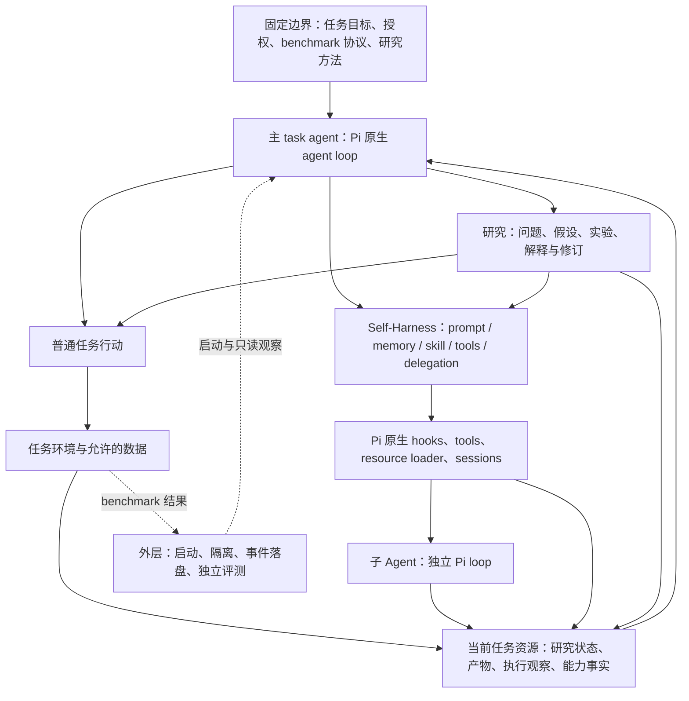

# Auto-Research 与 Pi 原生 Self-Harness：完整范围与机制设计

- 日期：2026-09-11
- 状态：供审阅的目标设计；不表示下述能力已经全部实现。
- 目标：让 Agent 在一个任务内自主设计研究，同时创建、选择和修订真正影响后续执行的 prompt、memory、skills、工具及 subagent 配置。
- 运行时依据：本机 `@earendil-works/pi-coding-agent` 0.80.6 的公开 API、文档和示例。文档支持与本项目 RPC/benchmark 集成验证分开认定。
- 约束依据：仓库 task-local architecture 与 harness boundary track；原始外部 constitution 全文此前未找到，不声称已核对该原文。

## 1. 总体架构

Pi 承载所有主、子 Agent 的模型和工具循环。主 task agent 根据任务进展，自主选择普通行动、研究或执行条件调整。Auto-Research 提供稳定方法与可持续的研究工作状态；Self-Harness 提供具体能力的操作入口。两者不存在强制先后顺序。



图表达可选信息关系，不规定每轮必须经过所有模块。只有模型调用、工具执行和实际交互才推进任务；新增记录本身不算研究成果或 harness 收益。

## 2. Auto-Research 的范围

Auto-Research 覆盖三类问题，由 task agent 选择是否研究：

| 研究对象 | 示例 | 可能产出 |
|---|---|---|
| 任务及环境 | 动作为什么无效、购物条件是否满足 | 任务事实、竞争解释、待验证规律 |
| 探索方法 | 哪个观察能区分解释、是否值得并行分析 | 实验安排、更有效的证据获取方法 |
| 执行方式 | 上下文是否遗漏关键证据、某 skill 是否值得复用 | 能力选择、修改建议、效果解释 |

研究可以处理间接依赖和局部 pattern，不必直接给出最终答案，也不必产生 harness 修改。已有成功和失败都可以成为证据。任务反馈足够时，可以直接执行或调整，不必先进入正式研究。

稳定方法说明保持只读：区分观察与解释、寻找有区分力的证据、保留适用条件、根据反证修订、权衡探索价值和成本。具体问题、实验方法、嵌套关系、停止条件由 Agent 自主创建和修改。

支持 Agent 先保存开放问题，再获取证据。开放问题可以尚无 evidence refs；宣称观察事实或提交有证据支持的 finding 时，需要指向实际来源。未测试的解释可以明确标为假设，不能通过默认字段伪装成已验证研究。

研究记录尽量沿用现有资源，不另建中央研究图或 scheduler。问题可带可选父问题引用；嵌套不自动创建子 Agent，也不自动划分新的权限或 memory。

一次有意义的研究至少应使后续选择发生变化，或排除一个原本合理的选择。可用的工作内容是：当前问题、暂定解释、待获取的区分证据、观察结果、适用条件、下一步或停止理由。无需每次工具调用填写全部内容。

## 3. Task-local 的定义

Task-local 指一个独立用户目标及其被授权的任务范围，不等于一次模型调用、一个 research goal、一个 Pi session 或一个操作系统进程。

| 情况 | 是否属于同一 task |
|---|---|
| ARC 同一游戏的一次 benchmark run，包含协议允许的全部关卡和尝试 | 是 |
| 该 run 内的 reset、子问题、子 Agent、资源 reload | 是；reset 不额外增加协议允许的预算 |
| 原执行中断后的受支持恢复 | 是，但必须恢复同一身份与资源，并确认环境可继续 |
| 新游戏、重新开始的独立 run、另一条 Shopping/Terminal-Bench 样本 | 否 |
| treatment 和 control | 各自独立，禁止相互读取派生产物 |

共享范围是上限，具体内容可以只适用于一个阶段、布局、研究分支或子 Agent。作用范围不会因为写入 task memory 自动升级为整个任务的普遍规律。

运行目录与 agentDir 按 task 隔离；子 Agent 仍属于父 task，可拥有自己的 session、工作目录与局部上下文。子 Agent 不因新进程或新 session 获得新的环境尝试额度。

恢复 Pi session 不等于恢复 benchmark 环境。环境无法恢复时，应报告该限制，不能创建新游戏后冒称原轨迹继续。

任务结束后保留产物供用户分析；新的独立任务从相同只读基线开始，不自动加载旧 task memory、skills、prompt 或 agents。跨任务学习属于未来独立实验协议。

## 4. 可使用资源与访问范围

| 资源 | 主 Agent | 子 Agent | 权限与含义 |
|---|---|---|---|
| 用户目标、固定方法、benchmark 契约 | 读取 | 获得适用部分 | 不可改写其权威版本 |
| 当前环境观察和允许的任务数据 | 读取，按协议行动 | 按委派范围读取/行动 | 不扩展 benchmark 原始权限 |
| 当前 task 的 research、memory、产物 | 读取和修订 | 默认读选定快照、写自己的结果 | 写共享资源需要明确委派 |
| 当前 task 创建的 skills、辅助脚本、agent 定义 | 创建、修改、加载或停用 | 默认使用所获资源，修改自己的工作副本 | 不回写全局基线 |
| 原始 trajectory、工具结果、能力生效记录 | 只读查询 | 读取被选定部分 | Agent 不能追溯改写审计事实 |
| 公开能力描述及实际加载状态 | 读取 | 读取自身能力状态 | 必须显示生效边界与不支持项 |
| 外部文件、网络、依赖库 | 仅任务协议允许时 | 不超过父任务权限 | ARC 不能借通用工具读取环境实现与隐藏答案 |
| scorer 内部条件、隐藏答案、其他 run 产物 | 不提供 | 不提供 | 运行后授权分析与执行期访问分开 |
| 凭据和 provider 配置 | 由启动层使用 | 按需安全传递给 runtime | 不作为研究材料暴露 |

建议区分 `workspace/`（模型可见任务文件）与 `audit/`（runner/extension 持有的完整原始记录）；既有 JSONL 暂不必迁移，使用明确路径和只读投影即可。

在 ARC 中，新增文件/计算能力限定于 task workspace、公开库和已授权观察。Terminal-Bench 原本允许的容器 shell 按原协议保留。工具描述和路径约定本身不是文件系统隔离，实际执行入口必须遵守访问边界。

## 5. 可操控内容与 Pi 原生接入

### 5.1 Prompt 与执行指导

Agent 可修改当前 task 的可变指导，包括采用的探索方式、验证习惯和阶段策略。固定 system contract、任务目标、benchmark adapter 契约和 Auto-Research 方法不可被覆盖。

可变指导通过组件自己的 Pi extension 管理：

- 需要下一模型请求生效的工作指导：使用 `context` hook 投影当前有效内容。
- 需要 system prompt 层更新的指导：使用 `before_agent_start`；生效边界是后续 agent loop 开始，而非任意工具调用后的下一请求。
- Prompt template 是可复用输入模板；被加载不代表自动参与所有请求。

每次替换当前投影，而非把所有历史版本追加到对话。明确标注为任务工作状态，其语义权威低于固定契约。原生 hook 能做文本修改，不意味着它能够从语义上保证模型不会违背指令；硬边界仍由工具和环境执行。

### 5.2 Memory 与研究状态

Agent 可保存和更新事实、假设、问题、当前策略及重要未决依赖，选择保持可见的内容，并将无用内容移出活跃视图。历史原始证据保留。

当前 `research-resources.jsonl` 已包含 finding，Pi `context` hook 已注入活跃摘要。优先扩展这一载体支持开放问题与 Agent 选择的活跃内容，不增加重复的 memory 数据库。

普通任务记忆不必伪装为 research finding；研究问题也不能被迫先有观察或结论。相同事实只保留一个权威来源，其他组件按引用使用。文件和原生 session entry 可以承担不同组件的持久化，但不可形成两套互相独立可写的同内容状态。

模型每轮只见选定的短摘要和详细读取入口。当前固定“最近三条”只能算初始实现，不足以保证长程相关性；目标允许 Agent 固定关键问题、替换过期条目。自动截断应显示遗漏，不让任务约束在无提示情况下消失。

### 5.3 Skills 与辅助程序

Agent 可以在当前 task 创建、修改、读取及停用 Pi 格式 `SKILL.md`，并编写任务内辅助脚本。既有只读基线 skill 可以读取；修改应写为 task-local 副本。

Pi skill 是方法说明和资源包，不是加载后自动执行的代码。辅助脚本通过允许的工具执行；执行成功不自动证明其中的策略正确。

生命周期事实分开记录：文件已创建 → Pi 已发现/加载 → Agent 已读取内容 → 实际按该方法或脚本执行。它们不是强制流水线，但不能相互冒充。

本机 Pi 支持 `resources_discover` 提供显式 skill 路径。建议保留禁用全局自动发现，显式贡献 task-local skill 路径。实测 Pi 0.80.6 的 RPC 路径中，官方 tool-to-command follow-up reload 示例不会执行扩展命令：`sendUserMessage` 会关闭 command expansion。因此首轮不伪造 Agent 可触发的 native reload。新建 skill 在当前 run 中由 Pi `context` hook 暴露短索引，Agent 通过受限 `read` 获取完整 `SKILL.md` 后使用；在任务启动或受支持恢复时，`resources_discover` 可将已有 task-local skill 交给 Pi 原生 loader。两条路径分别记录为 `projected_to_context/read_by_agent` 和 `loaded_by_pi`。

`ctx.reload()` 属于命令上下文，tool execute 不能直接调用。当前 RPC 实测未提供从 LLM tool 安全转入命令上下文的可用入口，所以 reload 不作为首轮自主 skill 生效机制。未来若 Pi 提供受支持入口，再单独验证 reload 后的资源恢复；不调用私有 runtime，也不让 Python runner 代为判断何时 reload。

Agent 可通过允许的工具创建独立能力实现，但不开放整个 extension 运行时及固定守卫的无界改写。生成任意宿主 JS 并加载，不纳入首轮基线；首轮 executable skill 通过受限任务脚本入口使用。更广泛的自定义 extension 需单独确定执行权限。

### 5.4 工具可用范围

Agent 可以选择已授权工具的可见集合，通过 Pi `getAllTools/getActiveTools/setActiveTools` 检查并修改。工具列表应分别显示“允许使用”“已注册”“当前活跃”。

可在允许范围内注册任务辅助工具；Pi 0.80.6 文档支持运行中 `registerTool`，但不据此承诺任意生成代码均可安全加载。停用使用原生 active-tool 集合，不虚构通用优先级或删除 API。

禁用执行工具不应同时失去读取能力状态、重新启用和完成任务的必要入口。修改 schema、说明和实现只能涉及 Agent 创建的任务能力；benchmark action semantics 和 evaluator 不可改写。

### 5.5 Subagents

Agent 可以创建或修改任务内子 Agent 定义，并决定是否委派、问题范围、输入证据、工具集合及预期返回内容。子 Agent 可以处理研究或普通工作，不强制固定 reviewer、planner 或 refiner 角色。

本机 Pi 官方 subagent 示例由 extension tool 启动独立 Pi 进程，子进程使用自己的原生模型/工具循环；定义在每次调用时发现，支持修改后用于后续委派。它属于公开 extension 示例，不是默认已启用的核心内建 API。

采用该模式时：父 Agent 决策，Pi extension 承载一次明确委派及结果传输，Python runner 不选择子问题、不安排模型循环。不能将主 session 的 `newSession()` 误认为并发子 Agent。

子 Agent 默认读取选定证据快照，返回结论、证据和不确定性，由父 Agent 采纳。正在运行的子任务不因 agent 定义文件改变而静默换角色；更新作用于后续调用。

对于 ARC 这种共享可变环境，首轮子 Agent 只读分析，环境动作由主 Agent 执行。独立可写任务可按委派范围执行。多个 Agent 并发操作同一游戏暂不支持；否则会破坏动作顺序和归因。

子 Agent 的工具 allowlist 不是 OS sandbox。其文件、网络、环境动作权限不得超过父 task，不能读隐藏状态。官方示例的 user-level agents 自动发现需改为 task 内显式资源，避免污染基线。

## 6. 不开放的控制范围

- 用户任务目标、benchmark 规则、动作预算和尝试次数；
- 原始 observations、scorecard、审计历史及 evaluator；
- 全局 Auto-Research 方法、共享基线和其他任务资源；
- Pi kernel、SDK 私有实现、任意模型/工具 continuation 控制器；
- 通用 `mutate_harness`、全局 HarnessState 或整套 harness revision；
- 自动 evolution scheduler、每次事件固定的多组件 Refiner；
- 默认跨任务记忆继承、隐藏 benchmark 信息和凭据读取。

模型及额外模型供应商、无限递归委派不纳入首轮自主修改面。初期子 Agent 使用协议指定模型；所有调用与环境动作计入所属 task 的总成本。并发与返回大小按实验协议显式配置，不私自添加新的任务超时或游戏尝试限制。

## 7. 运行机制与触发

Agent 可选择以下行动，无固定研究前置流程：

1. 信息足够：直接完成任务。
2. 有未解决的不确定性：提出问题，选择要获取的证据。
3. 当前执行方式存在摩擦：直接调整合适能力，或先研究收益是否值得。
4. 新能力有助于获取证据：先创建 skill/委派分析/修改上下文，再推进研究。
5. 新证据改变旧认识：修订相关问题、memory、skill 或执行指导。
6. 当前研究不再值得投入：保留必要结论，停止或返回上层问题。

重复失败、成功模式、阶段变化、上下文压力和待处理的能力效果，作为可见事实提供给 Agent；它们不自动触发研究或 mutation。Agent 自行选择组件和时机。

不强制引用 finding 作为所有操作的门票。操作可以引用 observation、研究问题、已有产物或能力限制；有不确定性的调整明确记录为试探。涉及历史内容压缩时仍需保留可恢复来源和必要摘要，不能因解耦而移除数据可恢复性保障。

持续能力应允许多次更新、停用和重新启用，不施加“当前 task 只能发生一次调整”的一般限制。每次以具体组件为单位生效；并发修改使用该组件的版本检查即可，不建立全局事务引擎。

## 8. Agent 每轮实际看到什么

固定输入包含任务目标、benchmark 契约、稳定方法及当前工具描述。Pi 原生 context 入口按需投影一份紧凑的当前状态：

```text
当前工作问题与进展
相关结论、假设及剩余不确定性
当前采用的执行指导
可用 skill / memory / delegation 的简短入口与作用范围
尚未生效的操作、相关反证和待解释效果
详细证据的读取引用
```

该视图来自组件已有权威状态，不是可独立写入的新数据库或控制器。没有相关内容时不注入空表格；不每轮重新扫描全目录或完整日志。派生缓存可重建，更新以变更为单位；加载成本、context token 和额外工具调用进入性能评估。

这种可见性提升不保证模型必然开展研究。若实际使用率低，应分析信息价值、入口成本及模型选择，不以强制 research/mutation 配额掩盖问题。

## 9. 生效、效果与归因

每个具体能力留下三个可关联事实：依据是什么；调用了哪个 Pi 入口；后续实际发生了什么。沿用现有 JSONL 和 native events，不新增统一 ledger 服务。

原生事实自动落盘：组件版本、加载或活跃状态、后续上下文暴露、skill 读取或脚本执行、子 Agent 调用和返回。模型只在有新判断时补充解释，避免重复填写机械元数据。

评价区分：

- 文件/状态更新成功；
- 新条件被后续 Pi 执行使用；
- 预期行为是否发生；
- 任务正确性、得分与总成本是否改善；
- 效果是否被 Agent 用于后续研究或能力修订。

provider payload 观测只留必要摘要、标识或哈希，不重复保存完整 prompt。字数减少说明表示变化，不能独自证明任务收益；子 Agent 同意主 Agent 也不是独立环境验证。

intervention 无研究依据时可称自主调整，不能自动算作 Auto-Research 驱动的闭环。不存在干预的运行仍可任务成功；研究结果只改变普通行动也可具有研究价值。

## 10. Meta 与外推能力的机制约束

Meta 的作用是让 Agent 能设计和改变认识问题的方式，包括选择研究问题、实验、证据、能力组合和停止条件。它不以 finding 数量或修改次数定义。

保留稳定的方法、允许开放问题、显示相关研究状态、保持依据与适用条件、允许撤回和修订，构成研究持续的基本条件。Self-Harness 既可以执行研究结果，也可以改善研究本身。

与本地文档描述的 Continual Harness 可以共享执行模块；区别不能仅由使用 Pi 或没有 Refiner 的命名来证明。实际检验 Agent 是否自主设计有区分力的探索，是否在旧规律失效时修订方法，以及是否因此获得增量收益。

外推分别评价：同一 task 新条件下能否正确复用知识；旧知识失效时能否重新学习；跨独立任务能否用相同基线方法和能力取得收益。第三种不默认继承任务产物。

skill/prompt 中的经验保留可查询依据与适用条件，不能因为被反复注入就被认定为确定事实。框架不硬编码“换关必研究”或“失败两次必改策略”。

## 11. 失败处理与成本

| 情况 | 处理方式 |
|---|---|
| Skill 写入但加载失败 | 返回原生诊断，区分文件存在与能力可用；Agent 决定修复或继续 |
| 新 skill 未经原生 loader reload | 当前 run 只宣称 context index 已投影、文件已读取；不宣称 `loaded_by_pi` |
| 恢复时资源加载失败 | 从组件持久化资源检查路径与诊断；不把文件存在冒充能力可用 |
| 子 Agent 失败或返回旧版本结论 | 返回失败/输入版本；主 Agent 决定重试或采纳，不自动修改父状态 |
| 过时规律持续影响决策 | 允许停用、替换和查回依据；显示相关反证 |
| 多个变化重叠 | 记录各自实际使用区间，对无法区分的收益保持不确定 |
| 模型错误、进程中断 | 事件随执行写盘，报告不完整 run；不得把缺少 scorecard 当正常完成 |
| 额外研究或委派抵消收益 | 报告包含所有子调用的总 token、成本、延迟与任务结果 |

机制不增加每步强制研究调用。发现、读取、执行与审计尽量复用已有 Pi 入口及结果。公开 benchmark 协议未允许的 batch 不因 skill 或 subagent 自动获准。

## 12. 实施目标与验证

第一阶段目标覆盖 prompt、memory、skills、subagents 四类最小可用能力；工具可用范围调整作为公共基础。实现可分批，不能仅有 memory 摘要就宣布该阶段完成。

先做不消耗游戏动作的 Pi 集成验证：指导在声明边界生效、开放问题跨请求可见、skill 创建/索引投影/读取与启动时原生加载可区分、子 Agent 独立 Pi 执行并返回、task 间隔离及调用成本完整记录。

随后运行真实 benchmark。ARC 子 Agent 首轮只读；所有实际动作保持 benchmark 原有计数和反馈语义。新任务根目录运行，旧实验协议结果与扩展后结果分别标识。

推荐对照：

| 条件 | 能力 | 用途 |
|---|---|---|
| Pi 基线 | 原任务 adapter | 原始任务表现 |
| Self-Harness | 相同扩展能力＋普通任务笔记 | 测量执行能力本身的价值 |
| Auto-Research＋Self-Harness | 相同能力＋研究方法和工作状态 | 测量研究机制的增量 |

后两组具有相同模型、环境权限和可用计算上限，记录实际消耗差异；普通笔记保持同等读写能力，不以剥夺对照组记忆制造收益。若需区分研究提示与资源呈现的贡献，再做针对性消融。

任务指标包括得分、正确性、动作数、总 token/成本和完成率；研究指标检查前瞻问题与实际探索的关联、反证后的修订、条件变化后的恢复成本。过程记录是机制证据，不替代结果对照。正式收益结论需要完整 run、多次重复及不确定性分析。

## 13. 关键架构决策与取舍

| 决策 | 理由 | 代价/限制 |
|---|---|---|
| 同一 task agent 决定任务、研究与调整 | 避免强制研究门票，保留自主性 | 不能保证模型每次都发现研究机会 |
| 扩展四类能力，按组件接入 Pi | 提供有实际用途的执行手段 | 工程和观测范围扩大 |
| 开放问题与已有 finding 共用轻量资源 | 支持探索前设计及后续修订 | 必须区分假设与证据支持的结论 |
| 保留全局发现隔离，显式提供 task 资源 | 可使用 Pi 原生能力且避免跨任务污染 | 必须验证资源加载和 reload 语义 |
| Subagent 使用 Pi 官方 extension 模式 | 所有模型/工具循环仍由 Pi 执行 | 官方示例需适配权限、成本及基准规则 |
| 审计引用具体组件，不建统一 mutation API | 降低耦合，真实表达不同生效时机 | 各组件分别处理生命周期 |

未选择的方案：继续只扩展 finding；一次引入完整 HarnessEvolver；直接开放全局资源发现。这些方案分别缺少执行能力、改变决策所有权或破坏任务隔离。

## 14. 当前实现与目标设计的区别

- 已有：Pi task loop、benchmark adapters、研究工具、活跃 finding/context 投影、部分 tool-set/observation compaction 能力及审计。
- 待扩展：开放研究问题、可反复修订的执行指导、完整任务内 skill 生命周期、Pi subagent 委派及其权限与成本观测。
- 当前 observation compaction 含“一次 task 只能有一个 active decision”的实现限制；目标设计需支持受控更新，不能将该限制当作通用架构原则。
- 本机公开文档已支持：`context`、`before_agent_start`、`resources_discover`、命令级 `ctx.reload()`、动态 `registerTool`、`setActiveTools` 以及 subagent 示例。
- 本项目已验证：开放问题与 task memory/system-prompt overlay 的后续 context 投影；task skill 的创建、后续索引投影和读取；启动时通过 task-local resource projection 在 `--no-skills` 下加载显式 task skill；受限 ARC 子 Agent 的独立 Pi 调用、工具 allowlist、结果和 token 落盘。
- 本项目已证伪为当前自主入口：RPC 中从 LLM tool 排队扩展 command reload。该限制不由 Python 调度器或 Pi 私有 API 绕过。
- 不声称支持：无边界热替换任意 harness 代码、通过 `newSession()` 并发创建子 Agent、skill 文件写入后立刻自动执行、`before_agent_start` 每个模型请求都触发。

此前 `docs/research-resource-agent-view.md` 中“finding 不自动进入上下文”的描述不符合当前 ARC 实现；本设计以 `demo/pi_external_benchmark_research.ts` 中已有的 `context` hook 为准，避免重复实现同类 memory 投影。

## 15. 依据

- `docs/plans/2026-09-06-autoresearch-pi-task-local-architecture.md`
- `docs/tracks/2026-09-05-harness-boundary-track-v1.md`
- `docs/plans/2026-09-11-continual-harness-absorption.md`（其中外部机制描述作为本地比较依据）
- `demo/auto_research_method.md`
- `demo/pi_external_benchmark_research.ts`
- `demo/pi_agent_owned_observation_compaction.ts`
- Pi 0.80.6 `docs/extensions.md`、`examples/extensions/dynamic-resources/`、`examples/extensions/subagent/`、`dist/core/resource-loader.js`
