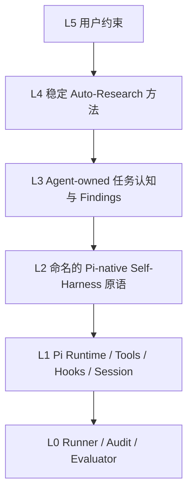

# AutoResearch Pi 本周工作回顾

> 时间范围：2026-09-07 至 2026-09-11  
> 主题：从宿主侧“自动演化控制器”转向 Pi 原生、任务代理主导、证据可审计的 Self-Harness

## 1. 执行摘要

本周的核心工作不是继续堆叠一个更复杂的外部 harness，而是重新划定系统边界：**Pi 是唯一的 agent runtime，只有正在执行任务的 agent 可以基于任务证据决定是否研究、是否形成 finding、是否应用机制；runner、meta、reviewer 和 evaluator 只负责执行、审计与评价，不能替 agent 做 mutation 决策。**

围绕这一原则，本周完成了以下几类尝试：

1. 将旧的宿主侧 `HarnessState + supervisor + checkpoint/rollback + AST mutation` 路线，逐步收敛为稳定方法、任务内研究记录、Pi 原生工具暴露和独立效果评估。
2. 在 OfficeBench 上跑通了真实的任务内闭环：发现问题、记录 finding、选择 apply、下一请求暴露新工具、使用工具、形成有界效果评估。
3. 在 Shopping 上完成了 20 个 Level-3 case 的 control/treatment 对比，但 treatment 的表面领先没有伴随机制 uptake，因此不能解释为 Self-Harness 带来的提升。
4. 验证了 observation representation / context compaction 的显著压缩效果；但压缩效率不等价于任务成功或 benchmark 提升。
5. 将相同原则扩展到 ARC-AGI-3 和 Terminal-Bench：ARC 已证明自主 finding 与 compaction 路径，Terminal-Bench 已完成适配器骨架，但两者都尚未建立端到端效果证据。
6. 明确撤回了一批自动化、任务特定、不可归因或没有真实 uptake 的机制，避免把“存在代码路径”误报为“机制有效”。

本周最重要的结论是：**Self-Harness 的最小可信单元已经从“系统自动改了什么”变成“任务 agent 为什么提出改变、改变何时暴露、是否被真实使用、影响是否由独立证据支持”。** 当前已经证明部分机制可以工作，但尚未证明它们能跨任务稳定提高 benchmark 成绩。

## 2. 本周工作量概览

- Git 记录：本周共 22 个 tracked commits。
- Tracked commit diff：约 18,365 行新增、515 行删除。
- 运行产物：175 个非 pytest 顶层 run 目录，其中 149 个包含 `summary.json`。
- 按目录名粗略归类：OfficeBench 88、Shopping 45、ARC 37、Terminal-Bench 1。
- 注意：run 目录包含重跑、失败、partial run、smoke test 和聚合目录，**不能将目录数直接视为 175 个独立、同分布、可比较实验样本**。

## 3. 本周推进时间线

### 3.1 9 月 7 日：重新定义 Self-Harness 边界

- 梳理旧架构中的宿主侧状态机、supervisor、自动 mutation、checkpoint/rollback 等机制。
- 发现旧路线的主要问题不是“能力不足”，而是决策归属错误：宿主根据代理行为推断 candidate，再替代理完成研究和演化，破坏了 agent ownership。
- 建立分层原则：稳定方法与任务内认知分离；runner 和 evaluator 只做外部执行与验证。
- 开始将研究过程改写为 append-only、versioned、可引用证据的 task-local findings。

### 3.2 9 月 8 日：OfficeBench 真实闭环

- 在 OfficeBench 日历任务中跑通首个完整的真实 task-local loop。
- agent 形成 finding，选择 apply，`calendar_batch` 在下一请求中暴露并被真实使用。
- 通过一个 bridge process 完成 12/12 日历事件创建，任务得分为 1.0。
- 独立 assessment 支持该次有界效果，但没有据此宣称一般性的 harness improvement。
- 随后在邮件任务中验证 `email_batch`，以一次 batch 完成 12/12 邮件发送，并闭合 assessment absorption 生命周期。

### 3.3 9 月 9 日：Observation representation 与 Shopping 扩展

- 将 observation 从无限累积的原始文本转为 canonical observations、紧凑 JSONL trace 和 agent-owned context compaction。
- 使用 Pi 原生 `context` hook，使 agent 能以精确引用的 observation 为依据执行压缩，而不是由 runner 私自投影或丢弃上下文。
- 为 Shopping 增加产品详情批处理候选机制，并开展 20-case control/treatment 对比。
- 通过真实 traces 排除多个“看起来合理但没有 uptake”的 Shopping 与 Office 候选机制。

### 3.4 9 月 10 日：ARC 与 Terminal-Bench 适配

- 为 ARC 引入确定性 delta、轨迹资源和只读 `inspect_arc_trajectory`，避免让模型依赖过强的人工先验。
- ARC 长 treatment run 证明了 agent 可自主形成 findings，并对长 observation history 执行高比例压缩。
- 为 Terminal-Bench 设计 Harbor/Docker 适配路径，坚持 native verifier 与 Self-Harness evidence 分离。
- `chess-best-move` smoke 未跑通，因此该适配器仍处于 plumbing/WIP 状态。

### 3.5 9 月 11 日：宪法式约束与后续吸收方案

- 使用更严格的 constitutional control/treatment cohort 检查机制链条与归因边界。
- 结果显示任务均可完成，但没有形成 mediator chain，不能归因于 treatment。
- 进一步提出下一阶段架构：独立 `TaskStrategyStore`、`strategy_context`、统一 progress events、组件级 reviewer、可执行 task skills 和受限 delegation。
- 明确把跨任务 continual learning 保留为独立实验轨道，不再作为默认 bootstrap 混入基线。

## 4. 架构演进

### 4.1 早期架构：宿主侧演化控制器

早期方案把“自我改进”主要放在 Python/runner 一侧：

```text
Task Agent
   ↓ 行为与日志
Host-side Supervisor / HarnessState
   ↓ 推断 candidate
Checkpoint → Mutation → Evaluation → Rollback/Keep
```

这条路线能够快速制造“系统发生了改变”的现象，但存在四个根本问题：

1. **决策主体错位**：candidate 往往由宿主从日志中推断，而不是 agent 基于任务证据显式提出。
2. **研究与执行混杂**：runner 同时决定改变、应用改变并评价改变，难以建立独立因果链。
3. **自动化过强**：level-up、game-over、stagnation 等事件触发自动演化，容易把阶段事件误当成研究证据。
4. **任务特定逻辑泄漏**：Shopping 推荐卡、固定阈值、ARC 强先验等逐渐进入 immutable contract，削弱通用性。

### 4.2 中间方案：单一 `evolve_harness` 入口

为减少宿主状态机复杂度，一度尝试使用单一 `evolve_harness` 控制器统一 findings、apply、rollback 和 exposure。该方案改善了接口数量，却没有解决 agent ownership：只要控制器仍自动替 agent 完成研究决策，架构问题仍然存在。

### 4.3 当前稳定架构：Pi 原生、agent-owned、证据驱动

当前保留的分层结构如下：



各层职责：

| 层级 | 当前职责 | 明确禁止 |
|---|---|---|
| L5 用户约束 | 定义任务目标、权限和不可变约束 | 不隐式替 agent 选择策略 |
| L4 稳定方法 | 提供通用 research/apply/assess 方法 | 不编码 benchmark 答案或任务特定策略 |
| L3 任务认知 | 保存 task-local findings、证据引用和判断 | 不由 runner 自动生成 candidate |
| L2 Self-Harness 原语 | 暴露批处理、context、轨迹检查等具名能力 | 不自动启用所有候选机制 |
| L1 Pi runtime | 执行 tools、hooks、session 与下一请求暴露 | 不引入第二套 agent runtime |
| L0 Runner/Audit/Evaluator | 启动任务、持久化、重算结果、审计效果 | 不应用 mutation，不自证改进 |

核心不变量：

> Pi 是唯一的 agent runtime。只有 task agent 能决定是否进入研究、形成 finding、选择 apply/keep。meta、runner、reviewer 和 evaluator 均不能应用 mutation。

## 5. 当前保留的结构与机制

### 5.1 稳定的通用研究方法

- 通用方法保存在 `demo/auto_research_method.md`，与具体 benchmark 和 task state 分离。
- 方法指导 agent 如何收集证据、形成 finding、选择 apply、等待 exposure、观察真实使用并吸收 assessment。
- 方法本身保持稳定，任务经验不直接反写为全局默认规则。

### 5.2 Task-local、append-only、versioned findings

- finding 属于当前任务，而不是 runner 的全局状态。
- 每次修订产生新版本，旧版本不可覆盖，保证审计和回放。
- finding 必须引用 observation/evidence；决策和 assessment 再引用 finding snapshot。
- `apply/keep` 不只是一条状态位，而是与不可变 finding 版本绑定的决策记录。

### 5.3 下一请求暴露

- agent 在当前请求选择 apply 后，机制不在同一上下文中“瞬时生效”。
- 新工具或策略上下文在下一请求暴露，使 decision → exposure → uptake 的顺序可观察。
- 该设计避免同一 turn 中同时提出机制、使用机制并自我评价造成的循环论证。

### 5.4 Pi 原生工具面

- OfficeBench：使用 Pi 原生 `setActiveTools()` 暴露 `calendar_batch` 和 `email_batch`。
- Shopping：保留产品批处理能力作为可验证工具面，但当前实验未观察到真实 batch uptake。
- ARC：保留确定性 delta 和只读 `inspect_arc_trajectory`，让 agent 检查轨迹而不获得答案型先验。
- Terminal-Bench：保留 Harbor/Docker adapter 方向，并将 native verifier 奖励与 Self-Harness evidence 分开记录。

### 5.5 Agent-owned context compaction

- observation 先规范化为 canonical representation，并以 compact JSONL trace 持久化。
- 由 Pi 原生 `context` hook 提供压缩能力。
- agent 必须精确引用要保留或概括的 observation，runner 不自动替它做语义相关性判断。
- 中断时保留 partial trace，避免只有成功 run 才有研究证据。

### 5.6 独立重算与 correctness gate

- benchmark 正确性由 Python 或 native verifier 独立重算。
- refiner、task agent 或研究组件不能自证“任务完成”或“harness 已改进”。
- 效果评估只允许在可定位的 request/window 内给出 `supported`、`unsupported` 或未建立结论。
- task score、机制 uptake、局部 effect 和 general improvement 分开统计。

### 5.7 同任务 rehydration 与任务间隔离

- 同一任务允许只读 rehydration，以恢复已经持久化的 findings 和证据链。
- 独立任务默认从 baseline 开始，不自动继承上一任务产生的策略。
- 跨任务 continual learning 被保留为未来独立实验，而不是默认行为。

### 5.8 Control/Treatment 分离

- control 不暴露 research surface 或 treatment-only 工具。
- treatment 允许 agent 研究和选择机制，但是否使用仍由 agent 自主决定。
- 没有 mediator chain 时，即使 treatment 得分更高，也不能归因于机制。

## 6. Control 与 Treatment 的详细区别

### 6.1 一句话定义

- **Control**：基线任务代理。保留完成任务所需的直接工具、相同任务输入和相同 evaluator，但不向 agent 暴露 Auto-Research 方法、研究资源、机制决策入口或 treatment-only 能力。
- **Treatment**：在相同基础任务能力之上，额外提供一套可选、task-local、agent-owned 的研究与 Self-Harness 能力；agent 可以使用，也可以完全忽略。

因此，treatment 不是“系统已经替 agent 应用了优化”，而是：

> agent 获得了发现问题、记录证据、选择机制、在下一请求观察机制、使用机制并吸收效果反馈的机会。

Control 与 treatment 的比较，本质上是在回答：

> 在其它条件尽量相同的情况下，给 agent 增加这套可选研究与自我调整能力，是否能带来可重复、可归因的任务收益？

### 6.2 两组保持一致的条件

配对实验不是让两个 agent 共享同一条运行轨迹，而是为每个 arm 启动独立运行，同时尽量固定实验条件：

| 不变量 | Control | Treatment |
|---|---|---|
| Benchmark case / task input | 相同 | 相同 |
| 模型与 provider 配置 | 相同 | 相同 |
| 任务预算、timeout、action 上限 | 相同实验配置 | 相同实验配置 |
| 直接任务工具 | 保留 | 保留 |
| 初始 workspace/cart/game | 新建、独立 | 新建、独立 |
| Pi runtime | 新的独立 Pi 进程 | 新的独立 Pi 进程 |
| Benchmark evaluator | 相同 | 相同 |
| 正确性重算 | 相同、独立于 agent | 相同、独立于 agent |
| 跨任务历史继承 | 默认无 | 默认无 |
| Runner 权限 | 只执行、持久化、统计 | 只执行、持久化、统计 |

每个 arm 都使用新进程和新 workspace，避免 treatment 的 finding、active tools、购物车状态或文件变化泄漏到 control。重复实验中还会交替运行顺序，降低“总是先跑 control”带来的缓存、服务状态或时间顺序偏差。

### 6.3 真正被操纵的实验变量

| 维度 | Control | Treatment |
|---|---|---|
| Auto-Research 方法 | 不注入 | 注入稳定通用方法 |
| Agent 可见 observation ID | 不附加研究用 observation card | 任务结果附加中立的 `EXECUTION_OBSERVATION` 元数据 |
| `research_resource` | 不暴露/禁用 | 可选，用于 record/open/update/resolve/inspect finding |
| Findings | agent 无法创建 | task-local、append-only、versioned |
| `apply/keep` 决策 | 不暴露 | 必须引用 active finding snapshot |
| Self-Harness capability catalog | 不披露 | 有界静态披露，不自动推荐具体 candidate |
| Treatment-only batch 工具 | 不可获得 | 初始隐藏；finding-backed apply 后才可在下一请求获得 |
| `pi.setActiveTools()` 动态 surface | 不由 agent 调整 | agent apply 后由 Pi 原生机制切换 |
| Surface exposure observation | 无 | 下一次模型请求记录并告知 agent |
| Effect window | 无 intervention window | apply 后按预先声明的 horizon 统计 |
| Pending assessment | 不注入 | 独立计算后返回，等待 agent 吸收或拒绝 |
| Context compaction | 不可用 | 仅在相应实验显式启用时可选使用 |
| Research trace | 应为 0 | 可以为 0；完全取决于 agent 是否研究 |

这里最关键的区别是：**treatment 只增加“可选择的能力”，不强制产生 finding，不强制 apply，也不强制使用 batch 或 compaction。**

### 6.4 Agent 实际看到的差异

#### Control 的视角

Control agent 通常只看到：

1. 原始任务说明；
2. 当前 benchmark 的直接任务工具；
3. 完整工具返回结果；
4. 与 treatment 相同的任务资源目录和执行约束。

它看不到：

- Auto-Research 方法正文；
- `research_resource`；
- `decide_execution_surface`；
- finding 摘要；
- pending effect assessment；
- treatment-only batch capability catalog；
- 用于研究引用的 `EXECUTION_OBSERVATION` card；
- agent-owned context compaction 入口。

Control 运行仍可能在磁盘上保留 execution observations，供 runner 审计和统一统计；但这些记录不会作为研究资源投影给 control agent。**“审计系统知道某个 observation”与“agent 在当时能引用该 observation 做研究”是两件不同的事。**

#### Treatment 的视角

Treatment agent 除了相同的任务输入和直接工具，还会看到：

1. 稳定的 Auto-Research 方法；
2. 当前任务有界 capability catalog；
3. 工具结果后的中立 observation ID 与 outcome 元数据；
4. 可选的 `research_resource`；
5. 可选的 apply/keep 决策入口；
6. 已激活 finding 的有界摘要；
7. 机制在下一请求生效后的 surface observation；
8. 独立效果评估产生的 pending assessment；
9. 实验显式启用时的 context compaction 能力。

这些信息告诉 agent“可以研究什么、如何留下证据以及机制何时真正生效”，但不告诉 agent 必须研究，也不替 agent决定哪个机制值得应用。

### 6.5 两组的典型执行流程

#### Control 流程

```text
任务输入
  → 使用直接任务工具
  → 修改 workspace/cart/game state
  → agent 给出最终回答
  → native evaluator / Python correctness 重算
```

Control 没有研究分支，也没有动态 mutation。其作用是提供“普通 Pi agent 在相同直接工具条件下”的基线表现。

#### Treatment 未触发机制时

```text
任务输入 + Auto-Research 方法 + capability disclosure
  → agent 判断无需研究
  → 直接使用任务工具完成或失败
  → evaluator 重算
```

这种 run 仍然是合法 treatment，但它没有发生实际 intervention。此时 treatment 与 control 的行为差异主要只剩额外提示和上下文开销，不能把 score 差异归因于 Self-Harness 机制。

#### Treatment 形成完整机制链时

```text
任务工具产生 observation
  → agent 引用 observation 创建 finding
  → agent 基于 active finding 选择 apply
  → Pi 使用 setActiveTools 改变后续执行面
  → 下一模型请求观察到新 surface
  → agent 真实使用 batch / compaction 等能力
  → 独立 evaluator 计算有界 effect assessment
  → assessment 回到任务上下文
  → agent 更新或 resolve finding，吸收或拒绝该反馈
```

只有这条链实际发生，才能说 treatment 产生了一个可分析的 mediator chain。

### 6.6 为什么使用“下一请求生效”

`pi.setActiveTools()` 只影响后续模型请求，而不会改变已经生成的当前 assistant response。这个时序是 control/treatment 归因中的关键：

1. agent 先根据已有 observation 做 decision；
2. runtime 记录 surface change，但此时 agent 尚未看到新工具；
3. 下一请求的 context hook 记录 agent 已观察到新 surface；
4. 只有 exposure 之后的相关 task action 才进入 effect window。

如果 apply 和 task action 位于同一个 assistant response 中，旧 surface 下已经发出的 task action不应被算作 treatment effect。否则会出现“机制尚未对模型可见，但系统已经把结果归功于机制”的时间穿越问题。

### 6.7 Finding、Decision、Exposure、Uptake 和 Effect 的区别

Treatment 内部至少有五个不同阶段，不能合并统计：

| 阶段 | 表示什么 | 能否证明机制有效 |
|---|---|---|
| Finding | agent 记录了一个有证据的任务内认识 | 不能，只证明发生了研究 |
| Decision | agent 选择 apply 或 keep | 不能，只证明做出选择 |
| Exposure | 新工具/上下文已在下一请求对 agent 可见 | 不能，只证明 treatment 已送达 |
| Uptake | agent 实际使用了新工具或压缩机制 | 不能单独证明，只证明机制被采用 |
| Effect | 独立窗口支持预声明的局部指标变化 | 只能支持局部作用，不能自动外推一般收益 |

完整链条还必须与最终任务结果结合：

```text
finding → apply → exposure → uptake → bounded effect → task outcome
```

例如，agent 创建 finding 并启用了 `calendar_batch`，但之后没有调用 batch，这只能记为“exposed but no uptake”；不能把更少的 turns 或更高的 score 归因于 batch。

### 6.8 各 benchmark 中的具体差异

#### OfficeBench

两组共同拥有：

- `officebench_action`
- `calendar_action`
- `email_action`
- `workspace_file_action`
- `task_notes`
- 相同 OfficeBench workspace contract 和 evaluator

Treatment 额外拥有：

- `research_resource`
- `decide_execution_surface`
- `EXECUTION_OBSERVATION` 引用元数据
- Auto-Research 方法和 capability catalog
- finding 摘要、surface observation、pending assessment

Treatment-only 动态能力：

- `calendar_batch_action`
- `email_batch_action`
- `calendar_focused` surface

这些动态能力初始不在 active tools 中，只有 agent 先形成 finding 并选择 apply，才会通过 `pi.setActiveTools()` 在下一请求暴露。Control 始终使用直接任务工具，不具备这条动态 surface 路径。

#### Shopping

两组共同拥有相同的基础 Shopping 工具、相同数据库输入、独立购物车和相同评分逻辑。

Control：

- 只暴露基础 Shopping tools；
- 返回完整任务结果，但不追加 research observation card；
- 禁用 research、surface decision 和 context compaction。

Treatment：

- 在基础工具之外暴露研究与 decision surface；
- 可以基于 finding 将 `shopping_batch_action` 加入 active tools；
- batch 目标是在一个 Pi tool call 和一个 bridge process 中添加 2–16 个商品；
- 可在专门实验中额外启用 agent-owned context compaction。

本周 20-case 对比中 treatment 没有产生 finding、decision、effect 或 Shopping batch uptake，因此这批运行实际测到的是“带额外研究提示的 agent 轨迹”与 baseline 的差异，而不是 batch Self-Harness intervention 的效果。

#### ARC-AGI-3

两组共同拥有：

- `arc_state`
- `arc_action`
- 原生 game state 和 action budget
- 每次 action 后的确定性 observation delta
- 相同 native task outcome 统计

Treatment 额外拥有：

- 只读 `inspect_arc_trajectory`；
- task-local `research_resource`；
- 可选 observation compaction；
- 提醒 agent 用精确 observation 证据记录局部模式或排除无效 probe 的方法提示。

Control 不暴露 research surface。当前 ARC control 与 treatment run 的时长和完整性不同，因此不能直接用 level 结果判断 treatment 优劣。

#### Terminal-Bench

设计目标是让两组共享：

- 相同 Terminal-Bench task；
- 相同 Harbor/Docker 环境；
- 相同 terminal execution contract；
- 相同 native verifier。

Treatment 才增加 task-local research、轨迹/observation 资源和可选 compaction。Native verifier 奖励始终独立于 agent research evidence，防止 treatment 自己宣布任务成功。当前 adapter 尚未完成真实端到端验证，所以这仍是设计差异而非已验证效果。

### 6.9 如何判断 treatment 是否真的优于 control

不能只看 treatment 的最终分数更高。至少应依次检查：

1. **可比性**：case、模型、预算、初始环境、evaluator 是否一致；run 是否都完整。
2. **送达性**：treatment 的目标机制是否在下一请求真正 exposure。
3. **采用性**：agent 是否实际 uptake，而不是仅看见 capability catalog。
4. **局部作用**：预声明 effect metric 是否由独立重算支持。
5. **任务收益**：score、strict pass、完成率或成本指标是否改善。
6. **重复性**：多个 repeat、case family 和 held-out case 中方向是否稳定。
7. **成本完整性**：必须计入研究提示、额外 turns、tool calls、token、latency 和失败风险。

可归因强度大致如下：

| 观测结果 | 可以得出的结论 |
|---|---|
| Treatment 分数更高，但无 mediator chain | 只能说两次随机轨迹不同 |
| 有 finding，无 apply | agent 进行了研究，但没有 intervention |
| 有 apply，无 exposure | mutation 尚未真正送达 agent |
| 有 exposure，无 uptake | agent 看到了机制，但没有使用 |
| 有 uptake，有 supported effect，分数持平 | 机制产生局部作用，但未提高任务正确性 |
| 单个 pair 有完整链且 treatment 获胜 | 候选正向证据，不能一般化 |
| 多 repeat、多 case、完整链稳定获胜 | 才开始支持一般性 improvement |

### 6.10 为什么 treatment 可能比 control 更差

Treatment 不是免费增强，它可能引入：

- 更长的 system prompt 和 capability disclosure；
- 更多 findings、decisions 和 assessment 上下文；
- 额外模型轮次与工具调用；
- 对本可直接完成任务的过度研究；
- exposure 太晚导致机制来不及发挥作用；
- 模型被可选机制分散注意力；
- stochastic trajectory 差异和偶发 length failure。

因此，control 获胜并不自动说明某个具体机制有害，treatment 获胜也不自动说明机制有效。必须先检查完整 mediator chain 和 confounders。

### 6.11 当前项目中两组最准确的理解

可以将两组理解为：

```text
Control   = 基础任务能力 + 独立评测

Treatment = 基础任务能力 + 可选研究能力
          + finding-backed 自我调整入口
          + 下一请求 exposure
          + 有界独立效果反馈
          + 独立评测
```

Treatment 的研究面不是完成任务的必经流程；`no finding`、`keep`、`no mutation` 和直接完成都属于合法结果。这个约束保证实验测量的是 agent 是否自主发现并使用有价值的机制，而不是 runner 是否能强制让每个 treatment run 看起来都发生了“自我改进”。

## 7. Goal 中明确排除或撤回的机制

以下机制并非都“完全错误”，但它们不符合当前 Goal 的 agent ownership、可归因性、通用性或真实 uptake 要求，因此从主线中排除。

| 被排除/撤回的机制 | 排除原因 | 本周证据或现象 |
|---|---|---|
| 旧 `HarnessState`、supervisor、checkpoint、rollback、AST mutation 协议 | 宿主成为第二决策主体；状态复杂且难以归因 | 架构重构后改为 task-local findings + Pi-native primitives |
| 单一 `evolve_harness` 控制器 | 接口统一但仍替 agent 自动研究和演化 | 未解决 ownership 根因 |
| level-up/game-over/stagnation 自动触发四组件演化 | 阶段事件不等于改进证据，容易制造伪闭环 | 改为 agent 显式 finding/apply |
| 自动 finding/apply/rollback | agent 没有做出可审计决策 | 当前要求显式版本化 finding 和 decision |
| 默认跨任务 bootstrap | 污染独立样本，破坏 control/treatment 隔离 | 独立任务恢复 baseline；continual learning 单列实验 |
| immutable contract 中的强 ARC priors | 任务特定先验可能泄漏答案结构 | 改为确定性 delta 和只读轨迹检查 |
| refiner 自证 improvement | 研究者与评价者角色冲突 | 使用独立 correctness/effect recomputation |
| runner 控制 Shopping observation projection | runner 实际替 agent 决定相关信息 | 改为 agent-owned context compaction |
| Shopping 推荐卡、决策卡、固定 break-even 阈值 | 任务特定、规则硬编码、泛化依据不足 | 不再进入稳定方法或 immutable contract |
| observation 后的一次性提醒 | 提醒不是持久机制，且难与任务收益建立因果关系 | 未保留为当前机制 |
| exact-repeat observation policy | 真实 traces 中 exact repeat 为 0 | 没有可作用对象，排除 |
| `shopping_selective_details` | 连续三次 autonomous trace 均未 uptake | 代码路径存在不代表 agent 需要它 |
| coupon-inclusive cart-plan batch | 价值依赖反馈，且常在下一请求过晚暴露 | 不适合作为默认稳定机制 |
| Excel cell batch | 三次 trace 均无 uptake，预期窗口未复现 | 排除出主线 |
| `learning_signal_signal` | 8 次隔离真实 run 中 uptake 为 0 | 后续移除 |
| 弱文本型 `set_evidence_policy` | 仅改变提示文本，缺少真实机制约束 | 从真实 OfficeBench 路径移除 |
| broad shell access | 权限过宽，无法保持可审计和最小能力面 | 替换为受限 workspace file actions |
| runner candidate inference | runner 根据行为猜测改进方向，违背 agent ownership | candidate 必须由 task agent 显式提出 |
| working-set controller / 自动相关性排序 | runner 隐式控制上下文语义 | 由 agent 通过引用和 context hook 主动压缩 |

## 8. 实验效果统计

### 8.1 OfficeBench：首个真实闭环

#### 日历任务 `2-13-0`

产物：`runs/effect-high-2-13-0-real-8-closed-loop-summary/summary.json`

| 指标 | 结果 |
|---|---:|
| 任务得分 | 1.0 |
| 创建日历文件 | 12 |
| finding | 1 |
| apply decision | 1 |
| batch exposure | 下一请求暴露 `calendar_batch` |
| bridge process | 1 个进程完成 12/12 create |
| 有界效果 | supported |
| 一般性 harness improvement | not established |

意义：该实验首次证明了完整机制链可以在真实任务中发生，而不仅是 scripted test：

```text
observation → finding → apply → next-request exposure
→ real uptake → bounded assessment → assessment absorption
```

限制：单个成功 case 只能证明闭环可运行，不能证明跨任务平均收益。

#### 邮件任务 `3-6-0`

- 得分 1.0。
- 通过一次 email batch 完成 12/12 邮件发送。
- research lifecycle 包含 assessment absorption，链条完整。
- 仍未据此宣称 general improvement。

### 8.2 OfficeBench：`learning_signal` 配对实验

产物：`runs/paired-2-13-0-learning-signal-r4/summary.json`

| 指标 | Control | Treatment |
|---|---:|---:|
| 通过次数 | 4/4 | 4/4 |
| 得分提升 | 无 | 无 |
| treatment supported effect | - | 3/4 runs |

四次 bridge process 差值为：`-20、+8、-3、-21`。

解释：treatment 在部分 run 中出现有界支持效果，但没有 score gain，且效果方向并不稳定。后续单独检查发现 `learning_signal_signal` 在 8 次隔离真实 run 中 uptake 为 0，因此该机制被移除。这个案例说明：**局部评估字段存在或偶发 process reduction，不足以证明机制本身具有稳定价值。**

### 8.3 最新 Office constitutional cohort

产物：`runs/constitutional-v1-office-cohort-r1/summary.json`

| 指标 | 结果 |
|---|---:|
| Case 数 | 2 |
| Control 通过 | 2/2 |
| Treatment 通过 | 2/2 |
| Mediator chains | 0 |
| Treatment - Control 平均 turns | -1.5 |
| Treatment - Control 平均 bridge processes | -0.5 |

解释：treatment 表面上使用了更少 turns 和 bridge processes，但没有任何 mediator chain，因此不能将差值归因于 Self-Harness 机制。

### 8.4 Shopping Level-3：20-case control/treatment

产物：

- `runs/shopping-level3-20-control-r1/`
- `runs/shopping-level3-20-treatment-r1/`
- `runs/constitutional-v1-shopping-cohort-r1/summary.json`

| 指标 | Control | Treatment | 差值 |
|---|---:|---:|---:|
| 总得分 | 15.8667 / 20 | 16.5667 / 20 | +0.7000 |
| 平均得分 | 79.33% | 82.83% | +3.50pp |
| Strict pass | 13/20 | 13/20 | 0 |
| Agent completed | 16/20 | 18/20 | +2 |

配对结果：

- Treatment wins：2
- Control wins：2
- Ties：16

关键机制统计：

| Treatment 机制事件 | 数量 |
|---|---:|
| Findings | 0 |
| Decisions | 0 |
| Effects | 0 |
| Shopping batch uptake | 0 |

结论：虽然 treatment 平均分表面领先 3.50 个百分点，但没有 finding、decision、effect 或 batch uptake。**该领先只能视为运行采样差异，不能视为机制提升证据。**

目标 case 重跑结果：

- Control case 13/18 仍为 0。
- Treatment case 18 提升至 1.0。
- Treatment case 8 在最新重跑中回落为 0。
- 使用每个 case 最新重跑结果聚合约为 80.50%。
- 使用 best-per-case 聚合约为 83.83%。

这些重跑是针对失败 case 的选择性实验，不能替换原始 20-case 配对结果；尤其 best-per-case 存在明显选择偏差。

### 8.5 Observation compaction

#### 旧 OfficeBench trace 的只读重编码

| 指标 | 数值 |
|---|---:|
| 原始体积 | 861,040,757 bytes |
| 重编码后 | 5,821,307 bytes |
| 降幅 | 99.32% |
| 压缩倍数 | 约 147.9× |

该结果证明 canonical observation representation 对存储和回放非常有效，但它是历史 trace 的只读重编码结果，不代表在线任务得分提升。

#### ARC 长 treatment partial run

产物：`runs/arc-trajectory-treatment-20260911-r2/`

| 指标 | 数值 |
|---|---:|
| ARC actions | 55 |
| Observations | 70 |
| Findings | 3 个 finding，共 7 个版本 |
| Research exposures | 80 |
| Compaction decisions | 1 |
| Supported assessments | 1 |
| 压缩前字符数 | 90,671 |
| 压缩后字符数 | 1,336 |
| 删除字符数 | 89,335 |
| 降幅 | 约 98.53% |
| 完成 level | 0 |

意义：真实 agent 能自主识别上下文膨胀、形成 finding、应用 compaction 并获得有界支持评估。

限制：run 未完成任何 level，因此只能证明研究与压缩机制工作，不能证明 ARC 能力提升。

### 8.6 ARC control/treatment 状态

Control 产物：`runs/arc-trajectory-control-20260911-r1/`

- Control 执行 41 个 actions，并到达 level 1。
- Control 没有 research surface。
- Treatment 是更长的 partial run，执行 55 个 actions，但未完成 level。
- 两个 run 的时长、终止条件和完整性不同，不构成有效因果配对。
- 已完成 ARC summaries 中多数为 0 level；另有若干失败来自 provider/model routing，而非任务策略本身。
- scripted run 已机械证明 finding/decision/effect 路径，真实长 treatment 已证明自主 findings 与 compaction，但尚未证明任务成绩提升。

当前结论：**ARC treatment 相比 control 的改进尚未建立。**

### 8.7 Terminal-Bench

产物：`runs/terminal-smoke-chess-20260910/summary.json`

`chess-best-move` smoke 结果：

| 指标 | 结果 |
|---|---:|
| Return code | 1 |
| Native verifier reward | 无 |
| Observations | 0 |
| Research artifacts | 0 |

当前仅能确认 adapter plumbing 已开始建立；真实 Harbor/Docker 任务、native verifier、observation capture 和 research lifecycle 尚未端到端闭合。

## 9. 如何正确解释本周实验

本周需要严格区分以下五层结果：

1. **代码路径存在**：工具或 hook 已实现。
2. **机制被暴露**：机制在下一请求进入 agent 可见范围。
3. **机制被 uptake**：agent 在真实任务中实际调用或使用。
4. **局部效果被支持**：独立 assessment 在有界窗口内支持影响。
5. **一般性 improvement 被建立**：在可比、重复、足够规模的 control/treatment 中稳定提升目标指标。

目前的证据状态：

| 能力层级 | 当前状态 |
|---|---|
| 代码路径存在 | 已建立，多 benchmark 有实现 |
| 下一请求暴露 | OfficeBench 已建立 |
| 真实 uptake | Office calendar/email batch 与 ARC compaction 已建立 |
| 有界局部效果 | 部分 Office 与 ARC run 已建立 |
| 跨 case 一般性 improvement | 尚未建立 |

因此本周不能得出“Self-Harness 已显著提升整体 benchmark”的结论。更准确的表述是：

> 已建立 agent-owned research lifecycle 的可运行性、可审计性和部分局部作用证据；尚未建立跨任务、可重复、可归因的平均成绩提升。

## 10. 当前最新结构的不足与风险

### 10.1 机制 uptake 稀疏

- Shopping treatment 中没有 findings、decisions 或 effects。
- 多个候选机制在真实 trace 中没有被 agent 选择。
- 这可能意味着候选机制价值不足，也可能意味着 exposure 时机、成本或策略上下文仍不合适。

### 10.2 样本量和运行稳定性不足

- Office 的完整闭环仍集中在少数 case。
- ARC 存在 incomplete run 与 provider/model routing failures。
- Terminal-Bench 尚未完成一次真实端到端 smoke。

### 10.3 “压缩有效”与“任务有效”仍需拆分

- 当前 compaction 的字节/字符降幅非常显著。
- 但尚缺少相同任务、相同预算、相同终止条件下的质量保持和成绩对比。
- 后续应同时统计 retention correctness、任务分数、token/latency 和恢复后的决策质量。

### 10.4 工作树处于并行 WIP 状态

- 当前有 13 个 tracked modified files，约 `+660/-35`，另有 ARC/Terminal 相关 untracked files。
- 排除 `tests/test_arc_agi_3_e2e.py` 时，当前 163 个测试通过。
- 全量测试在 collection 阶段失败：测试尝试导入 `_compact_arc_pi_event`，但 `src/autoresearch_pi/arc_agi_3_e2e.py` 当前未定义或导出该符号。
- 该问题属于当前 ARC/Terminal 并行开发状态，本周回顾不对其做额外修复。

## 11. 最新提案但尚未完全实现的结构

下一阶段架构已在 `docs/plans/2026-09-11-continual-harness-absorption.md` 中提出，但不应与当前已验证实现混为一谈：

1. **`TaskStrategyStore`**：将任务策略、finding history 与原始 observation storage 分离。
2. **`strategy_context` 原语**：以受控、可引用方式向 agent 暴露当前策略，而不是拼接任意文本。
3. **统一 progress events**：让 Office、Shopping、ARC、Terminal 共享可审计的进展事件模型。
4. **组件级 reviewer**：评价具体 tool/context/strategy component，而不是笼统评价整个 harness。
5. **可执行 task skills**：把已验证策略包装为 agent 可选择的执行能力，而不是自动全局注入。
6. **受限 subagent/delegation**：只在明确权限、预算和可审计边界内允许委派。
7. **跨任务 continual learning**：作为独立 treatment 研究，不进入默认 baseline。

## 12. 下周建议优先级

### P0：先建立可归因的重复实验

- 固定模型、provider、预算、终止条件和 benchmark case。
- 为 Office 已有完整 mediator chain 的任务做多 seed control/treatment 重复。
- 报告 score、turns、bridge processes、tool uptake、effect 和失败类型，不只报告总分。

### P0：完成 ARC 与 Terminal 的基础闭环

- 修复 ARC 当前测试 collection 阻塞，冻结可运行基线。
- 为 ARC 设计同条件、同预算的完整 control/treatment pair。
- 完成至少一个 Terminal-Bench 真实任务的 observation → verifier → summary 链路，再加入 research surface。

### P1：验证 compaction 的质量保持

- 除压缩率外增加 cited-fact retention、恢复正确率、后续动作质量和 token/latency 指标。
- 对相同 trace 比较 no-compaction、runner compaction 和 agent-owned compaction，但保持评价器独立。

### P1：降低“无 uptake 机制”的研发成本

- 新候选机制先做 exposure/uptake gate，再进入大规模 benchmark。
- 连续多次真实 run 无 uptake 时自动进入候选淘汰队列，但淘汰结论仍由 reviewer 记录，不自动 mutation。
- 避免仅凭 scripted path 或 prompt plausibility 扩大实验规模。

### P2：推进统一策略存储，但保持跨任务学习隔离

- 先实现同任务 `TaskStrategyStore` 和 `strategy_context`。
- 完成组件级 assessment schema 后，再研究跨任务吸收。
- continual learning 必须设置独立 control，禁止默认继承污染基线。

## 13. 本周最终结论

本周最大的进展是完成了方法论收敛：项目从“宿主控制器自动演化 agent”转向“task agent 在 Pi 内基于证据研究和选择机制，外部系统只负责执行、持久化和独立评价”。

已经保留下来的核心资产包括：

- 稳定的 Auto-Research 方法；
- task-local、append-only、versioned findings；
- finding snapshot 支撑的 apply/keep decision；
- next-request exposure；
- Pi-native tools 和 context hook；
- canonical observations 与 compact JSONL trace；
- interruption 下的 partial persistence；
- 独立 correctness/effect recomputation；
- control/treatment 隔离与 mediator-chain 归因规则。

已经真实证明的部分包括：

- Office 日历和邮件任务中的完整研究闭环与 batch uptake；
- Office 个别 run 的有界局部效果；
- observation representation 的大幅存储压缩；
- ARC 长轨迹中的自主 findings 与 agent-owned compaction。

尚未证明的部分包括：

- 跨任务、跨 seed 的稳定 benchmark 提升；
- Shopping 表面 3.50pp 领先与 Self-Harness 机制之间的因果关系；
- ARC treatment 优于 control；
- Terminal-Bench 端到端有效性；
- 默认跨任务 continual learning 的收益与安全性。

因此当前最合理的项目状态判断是：**架构方向已经明显收敛，机制级闭环已被真实验证，但系统级效果仍处于需要更严格重复实验建立证据的阶段。**

## 14. 主要证据索引

- `README.md`
- `demo/auto_research_method.md`
- `docs/tracks/2026-09-07-autoresearch-self-harness-optimization.md`
- `docs/plans/2026-09-09-agent-owned-observation-context-compaction.md`
- `docs/plans/2026-09-09-agent-owned-observation-representation.md`
- `docs/plans/2026-09-10-arc-agi-3-terminal-bench-adapters.md`
- `docs/plans/2026-09-11-continual-harness-absorption.md`
- `runs/effect-high-2-13-0-real-8-closed-loop-summary/summary.json`
- `runs/paired-2-13-0-learning-signal-r4/summary.json`
- `runs/constitutional-v1-office-cohort-r1/summary.json`
- `runs/constitutional-v1-shopping-cohort-r1/summary.json`
- `runs/shopping-level3-20-control-r1/`
- `runs/shopping-level3-20-treatment-r1/`
- `runs/arc-trajectory-treatment-20260911-r2/`
- `runs/arc-trajectory-control-20260911-r1/`
- `runs/terminal-smoke-chess-20260910/summary.json`
